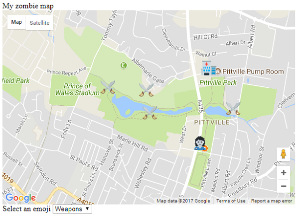

## Recuperar los datos del marcador

+ Puedes decidir dónde estarán tus puntos de interés creando un [Mapa de supervivencia apocalíptica Zombie](https://projects.raspberrypi.org/en/projects/zombie-apocalypse-map){:target="_blank"}. Aquí hay un mapa de ejemplo que creamos para un juego zombie en el parque local. Los datos para este mapa se copiaron de la **consola**.



```html
51.90769026213801 -2.068905830383301 zombie.png
51.91174087287536 -2.0681333541870117 hospital.png
51.91054955470073 -2.0736265182495117 weapons.png
51.909305255309874 -2.0733261108398438 weapons.png
51.91070839895001 -2.077016830444336 weapons.png
51.90954352807475 -2.0659875869750977 weapons.png
```

+También necesitarás copiar los archivos emoji que usaste cuando creaste el mapa, y pegarlos en el mismo directorio que el archivo `index.html` para tu juego. Usamos los siguientes emojis, pero es posible que hayas elegido diferentes en tu mapa.
  

+ Busca la línea de código `var mapa_zombi;`. Debajo, en una línea en blanco, crea una nueva variable llamada `datos`, y configúrala igual a los datos que copiaste de la consola. Pegar tus datos puede hacer que tu editor se queje y resalte las líneas de código de una manera extraña, así que pon una barra (\ `) al principio y al final de los datos que pegaste. Esto le dirá a JavaScript que lo que pegaste es una cadena dividida en varias líneas.
[[[generic-javascript-create-variable]]]

+ Queremos manejar cada marcador por separado, así que agreguemos algún código en la siguiente línea para dividir los datos en líneas separadas. Cada línea individual es información para un marcador, por lo que dividiremos los datos donde se detecte el carácter de nueva línea invisible `\ n`.
```JavaScript
var marcadores = data.split("\n");
```

[[[generic-javascript-split-string]]]

Terminamos con una **matriz** de datos de marcadores que trazaremos en el mapa en el siguiente paso.

--- collapse ---
---
title: Resultado final
---
```JavaScript
var datos = `51.90769026213801 -2.068905830383301 zombie.png
51.91174087287536 -2.0681333541870117 hospital.png
51.91054955470073 -2.0736265182495117 weapons.png
51.909305255309874 -2.0733261108398438 weapons.png
51.91070839895001 -2.077016830444336 weapons.png
51.90954352807475 -2.0659875869750977 weapons.png`;
var marcadores = data.split("\n");
```
--- /collapse ---
