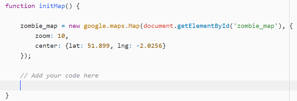

## Crea los marcadores

+ Debajo de la línea `var mapa_zombi;`, agrega otra línea para crear una variable llamada `todos_los_marcadores`. Establécelo igual a `[]`, que es una matriz en blanco. Esto eventualmente almacenará una referencia a cada uno de los marcadores que vamos a crear.

+ Coloca el cursor dentro de la función `inicializaMapa ()`, justo debajo del código para crear el mapa zombi.



+ Crea un bucle for que se ejecutará una vez por cada marcador en la matriz `marcadores` que creamos en el paso anterior. 

[[[generic-javascript-for-loop-array]]]

Dentro del bucle for, la línea de datos de marcador que estamos viendo actualmente es `marcadores [i]` - el bucle agregará `1` a la variable` i` cada vez que se ejecuta, por lo que vamos a ver cada línea de datos, uno por uno.

La primera línea de datos se ve así:

```html
51.90769026213801 -2.068905830383301 zombie.png
```

Queremos terminar con esta información como una matriz, por lo que necesitaremos dividirla tal como lo hicimos en el paso anterior.

+ Agrega todas las otras líneas de código en este paso dentro del bucle for. En primer lugar, elimina con `trim ()` espacios no deseados desde el principio y el final de los datos, de esta manera:

```JavaScript
var datos_marcadores = marcadores[i].trim();
```

+ Ahora divide la cadena como lo hicimos antes, pero esta vez dividida donde haya espacio:

```JavaScript
datos_marcadores = datos_marcadores.split(" ");
```

Al hacerlo, obtendrás una matriz llamada `datos_marcadores`, que contiene tres valores. En orden, estos son: la latitud, la longitud y el archivo de imagen de marcador.

+ Crear variables para nombrar cada uno de estos valores. Hemos hecho lo primero por ti:

```JavaScript
var latitud = datos_marcadores[0];
var longitud = ?;
var emoji = ?;
```

+ Para poder agregar el marcador en la posición correcta, debes crear un objeto `LatLng`.

```JavaScript
var posicion_marcador = new google.maps.LatLng(###, ###);
```

Agrega esta línea de código inmediatamente debajo de la línea anterior, reemplazando `###` con las variables de latitud y longitud.

+ Aún dentro del bucle, escribe un código para crear un marcador en `posicion_marcador`, con el `icon:` establecido en la variable emoji.

[[[generic-api-google-maps-marker]]]

--- consejos ---
--- consejo ---
En lugar de poner una latitud / longitud fija como en el ejemplo, usa la variable `posicion_marcador` para indicar al marcador dónde debe colocarse.
--- /consejo ---

--- consejo ---
Comprueba que el nombre del mapa (en el ejemplo `mimapa`) sea el mismo que el nombre del mapa que has creado.
--- /consejo ---

--- consejo ---
Puedes agregar un icono agregando otra línea dentro del marcador para especificar `icon:" nombreDeLaImagen.png "`. No olvides poner una coma al final de la línea `mapa` para indicar que hay otra propiedad de marcador que te gustaría establecer.
--- /consejo ---

--- consejo ---
Si especificas un nombre de archivo fijo como `nombreDeLaImagen.png`, entonces el icono del marcador siempre será el mismo. Creamos una variable anterior que contiene el nombre de la imagen: coloca la variable `emoji` como el icono especificado para usar el emoji correcto de los datos.

```JavaScript
var marcador = new google.maps.Marker({
  posicion: marker_position,
  mapa: mapa_zombi,
  icono: emoji
});
```
--- /consejo ---

--- /consejos ---

+ Inmediatamente después del final del código `marcador`, pero aún dentro del bucle, agrega la siguiente línea para guardar una referencia a este marcador en nuestra lista de `todos_los_marcadores`. Necesitaremos esta lista en un paso posterior.

```JavaScript
todos_los_marcadores.push(marker);
```

+ Guarda tu código y actualiza la página. Prueba que todos tus marcadores aparezcan en el mapa. Si no se muestran correctamente, tal vez podrías consultar la **consola** de JavaScript para ver si hay algún mensaje de error que puedas resolver.

[[[generic-javascript-opening-console]]]
