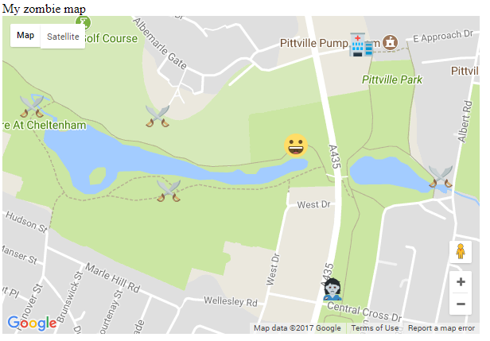

## Muestra tu posición actual

Vamos a mostrar la posición actual del jugador en el mapa.

+ Dentro de la función `inicializaMapa ()`, después de crear el mapa, agrega un código para usar la geolocalización de HTML5 para encontrar la posición actual del jugador:

```javascript
if(navigator.geolocation) {
    navigator.geolocation.watchPosition(actualiza_mi_posicion);
}
else {
    alert("La geolocalización no funciona en tu navegador");
}
```

Este código verifica si la ubicación del jugador se puede encontrar usando el navegador web. Si no se puede encontrar, aparecerá un cuadro emergente con un mensaje. Si se puede, configuramos el código para `watchPosition`. Este código supervisará constantemente la posición del dispositivo y llamará a la función `actualiza_mi_posicion` cada vez que cambie la posición del dispositivo.

+ Para poder mostrar la posición del jugador en el mapa, necesitamos escribir la función `actualiza_mi_posicion`. Después del corchete de cierre de la función `inicializaMapa()`, crea una nueva función llamada `actualiza_mi_posicion`.

[[[generic-javascript-create-a-function]]]

+ Esta función necesita la latitud y longitud actual mediante el comando `watchPosition` que configuramos. Agrega un **argumento** llamado `posicion` en los corchetes de la función para que estos datos se le pasen automáticamente.

`function actualiza_mi_posicion(posicion){`

+ La latitud se puede encontrar dentro de la función como `posicion.coords.latitude`, y la longitud como `posicion.coords.longitude`. Siguiendo el mismo proceso que hiciste en el paso anterior, crea un objeto LatLng llamado `pos` dentro de la función `actualiza_mi_posicion`. El objeto debe contener los valores de latitud y longitud.

```JavaScript
var pos = new google.maps.LatLng(###, ###);
```

+ Aún dentro de la función, crea un marcador que esté situado en la posición del objeto LatLng. Puedes hacer esto de la misma manera que creaste los marcadores en el paso anterior. Sin embargo, debes elegir un icono diferente para este marcador. Elegimos representar al jugador como una carita sonriente, pero puedes elegir cualquier emoji que te guste. No olvides copiar y pegar el archivo de imagen emoji que quieras usar en la misma carpeta que tu código `index.html`.


+ Guarda tu código y actualize el navegador de Internet. Si aparece un mensaje que te pregunta si el navegador puede usar tus datos de ubicación, presione **Permitir**. Deberías ver que tus emojis del jugador aparecen dondequiera que estés.



+ Es posible que desees ajustar el valor de 'zoom' en tu mapa en esta etapa si está demasiado lejos para ver claramente la ubicación de los iconos. El uso de un valor mayor hará zoom en el mapa.