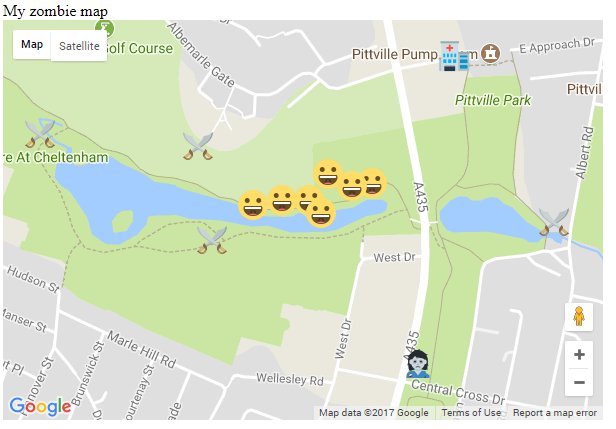

## Attack of the smileys

When you tested your map on your phone, you probably thought you were being attacked by smileys rather than zombies! This is because the page creates a brand new marker every time the player moves, but doesn't remove the markers of their previous positions. Eventually this gets really confusing, because you can't tell where you are from where you've been!



Continue editing the code on your computer. You can re-upload the code to GitHub if you want to test it outside.

+ Locate the line `var zombie_map;`, and below it add a new variable called `old_position`.

+ Inside the `initMap()` function, create a marker called `old_position` at the same location you centered your map on when you created it. (It actually doesn't matter what location this marker is initialised at, as its location value will be overwritten almost immediately, but it does need to be initialised. We just used the map's central location because it was handy!)

+ Locate your function `set_my_position()`. Add a line of code so that the **first** thing the function does is to remove the old position marker from the map. `null` is a special key word that in this case means "no map".

```JavaScript
old_position.setMap(null);
```

+ Add another line of code to the function `set_my_position()`, but this time it should be the **last** thing the function does. This saves the new position marker you just created as the `old_position` so that next time when we create a new marker we know where the previous one was.

```JavaScript
old_position = marker;
```

+ Save your code and upload it again to your web hosting service. Test the code out by walking around. You should see your player smiley move around, but this time there will be no trail of smileys, only one marker to show your current position. Phew!
