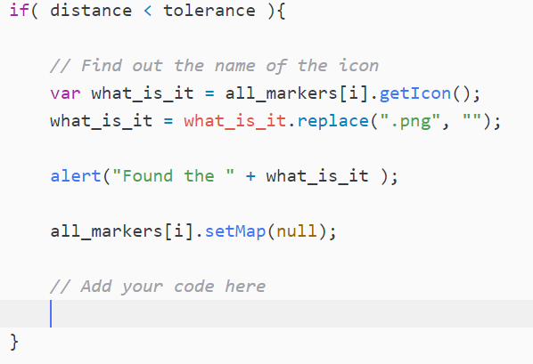

## Find the items

Now we need to make the game work! As the player moves around, we will check whether theey have found an item. To find an item, they have to go to a real-life location that is considered close enough to the virtual item's location.

+ Locate the line `var zombie_map;` and, below it, add a new variable called `tolerance`. This variable will determine how close the player will have to be to the item marker's location (in metres) to find it. You can choose how close this is - the smaller the number of metres, the closer the player will have to get to the exact location to find the item. We chose a tolerance of 10.

To be able to calculate the distance between two points on a map, we need to use some of Google's technical wizardry from their geometry library. Locate the code near the bottom of the page which tells the map your API key:

```html
<script async defer
src="https://maps.googleapis.com/maps/api/js?key=A1b2c3d4e5f6g7h8i9j10k11&callback=initMap">
</script>
```

+ In the line of code above, immediately after `initMap`, but before the ending `"`, add `&libraries=geometry`. Be careful to not add any spaces.

+ Now locate your `set_my_position()` function, and position your cursor immediately below the line `old_position = marker;`.

+ Create a for loop which will loop through the `all_markers` array.

[[[generic-javascript-for-loop-array]]]

+ Inside your loop, use the following code to calculate the distance between the current position (`pos`) and the marker we are currently examining:

```javascript
var distance = google.maps.geometry.spherical.computeDistanceBetween(pos, all_markers[i].getPosition());
```
The image below shows an example of one of the calculations. How far is it between the player and the hospital marker?


+ Add an `if` statement immediately below to check whether the distance between the player and the marker we are currently examining is less than the tolerance. It should look like this:

```javascript
if( distance < tolerance ){
    alert("Found it!")
}
```

At the moment we are not sure what it is the player has found.

+ Remove the line saying "Found it!", and instead get the name of the icon the player is close to.

```javascript
var what_is_it = all_markers[i].getIcon();
```

+ Remove the `.png` part from the name of the icon. For example, if the icon's name is `hospital.png`, we just want to say "hospital".

```javascript
what_is_it = what_is_it.replace(".png", "");

```
+ Create an alert to tell the player what they have found. In this case, the alert will say `Found the hospital`:

```javascript
alert("Found the " + what_is_it );
```

+ Remove the `all_markers[i]` marker from the map, so that the game does not keep telling the player they found the same thing.

--- hints ---
--- hint ---
Remember that we removed a marker from the map before, when we stopped the attack of the smileys.
--- /hint ---

--- hint ---
To remove a marker from the map, set the map of the marker to `null`, which means no map in this case.
--- /hint ---

--- hint ---
You will need to use the `.setMap()` method on the marker.
--- /hint ---

--- /hints ---

+ Finally, let's add a score. Once again, locate the line `var zombie_map;`, and add another line of code below it to create a variable called `score`.

If the player found a zombie, in my game they don't get any points. Perhaps if you are feeling particularly mean you could give your player minus points in your game! If they found a hospital or a weapon store they get 10 points.

+ Here is some pseudo code for the code we want to add. Translate it into real code and add it to your program.

```html
IF what they found isn't a zombie
    score + 10 points
    ALERT Your score is + score
```
Add your code here:




--- hints ---

--- hint ---
We already worked out what they found and stored it in the variable `what_is_it`. Use this to create a condition which says that the contents of this variable is not equal to (`!=`) zombie.
--- /hint ----

--- hint ---
You can add on points to a variable like this:

```javascript
score += 10
```
This means "`score` is whatever it was before plus 10".
--- /hint ----

--- hint ---
Solution:
```javascript
if( what_is_it != "zombie"){
    score += 10;
    alert("Your score is " + score);
}
```
--- /hint ----

--- /hints ---

+ Now it's time to test out your game! Have a read through the safety tips in the next step before you do any testing.
