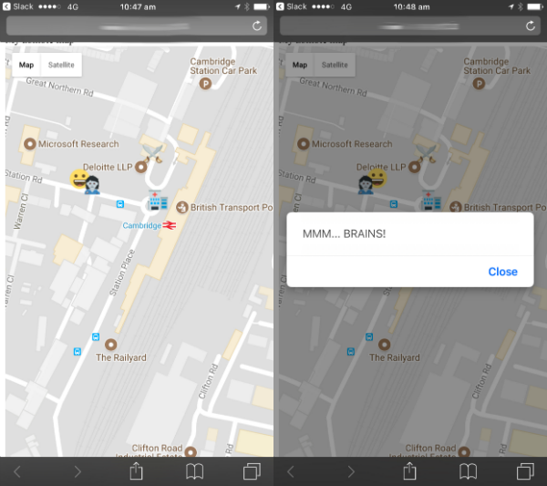

## Introduction

Use the GPS on your phone to make an outdoor zombie apocalypse game you can play with your friends. Collect the supplies to power up, but avoid the zombies!

This resource expects you to have already mapped out the location of your goodies and zombies using the [Zombie apocalypse map](https://projects.raspberrypi.org/en/projects/zombie-apocalypse-map){:target="_blank"} resource.

### What you will make

You will make a game that you can play outside using your mobile phone's GPS capabilities. Find the power-ups and avoid the zombies!

### What you will learn

This project covers elements from the following strands of the [Raspberry Pi Digital Making Curriculum](http://rpf.io/curriculum){:target="_blank"}:

+ [Design basic 2D and 3D assets](https://curriculum.raspberrypi.org/design/creator/){:target="_blank"}
+ [Apply abstraction and decomposition to solve more complex problems](https://curriculum.raspberrypi.org/programming/developer/){:target="_blank"}
+ [Engage and share with the digital making community](https://curriculum.raspberrypi.org/community-and-sharing/creator/){:target="_blank"}
