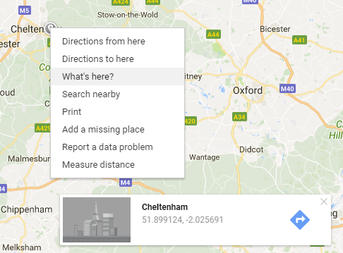
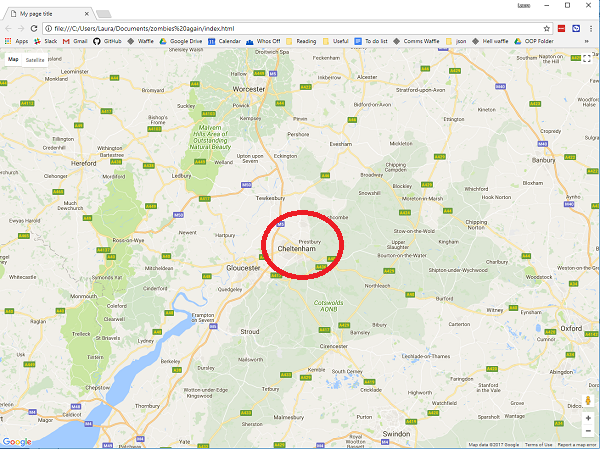

## Create the map

If you have already completed the [Zombie apocalypse survival map](https://projects.raspberrypi.org/en/projects/zombie-apocalypse-map){:target="_blank"} project, you will notice that the first few steps of this project are very similar.  **Make sure you start a fresh HTML file for this project rather than reusing your old code.** Otherwise you will get confused during the later stages.

+ Create and save a file called `index.html`. You will need to use a text editor on your computer to do this rather than an online HTML editor.

[[[generic-html-create-and-save]]]

+ In the file, add tags to create a basic HTML page.

[[[generic-html-basic-page]]]

+ If you don't already have one, obtain a Google Maps Javascript API key. Make sure you add the code for using the key to your `index.html` file.

[[[generic-api-google-maps-key]]]

+ In the text editor, find the `<head>` tag in your code. On a blank line below this tag, add the following code to set up how large your map will be and what colour will be displayed if it does not load properly.

```html
<style>
#zombie_map {
    height: 100%;
    width: 100%;
    left: 0;
    position: absolute;
    top: 0;  
    background-color: grey;
}
</style>
```

+ Locate the `<body>` tag in your code. On a blank line below this tag, add the following code to create a `<div>` (an invisible box) where your map will eventually appear.

```html
My zombie map
<div id="zombie_map"></div>
```

+ Locate a town on [Google Maps](http://maps.google.com){:target="_blank"}, then right-click on the map and select **What's here?**. A box will pop up at the bottom of the page showing the latitude and longitude.



+ Immediately below the `<div>` code you just added, add the following code to create the map. Replace the `###` bits with the latitude and longitude values you just looked up for your town.

```html
<script>
    var zombie_map;
    function initMap() {

            zombie_map = new google.maps.Map(document.getElementById('zombie_map'), {
            zoom: 10,
            center: {lat: ###, lng: ###}
        });
    }
</script>
```

+ Save your code and refresh your internet browser. You should see a Google map with the town you chose at the centre of the map.


