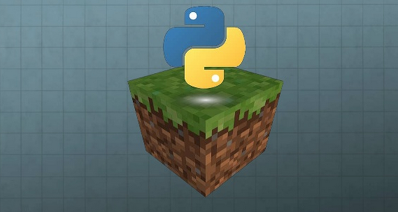
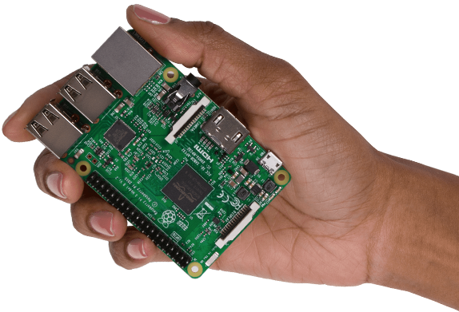
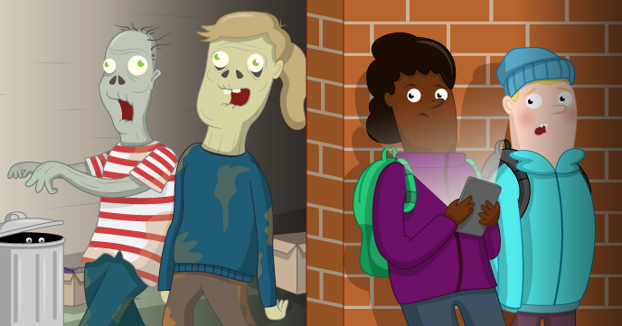

# Sitio web para alojar algunos apuntes personales

### Programar Minecraft desde python

- Si tienes una raspberry pi, puedes ir directamente a la [práctica inicial](https://jolosan.github.io/minecraft/practicaInicial.html).

- Si trabajas con Ubuntu o similar, primero deberás realizar la [instalación del software](https://jolosan.github.io/minecraft/minecraftUbuntu.html).

## Raspberry pi

- [Prácticas con la raspberry pi](https://jolosan.github.io/raspberryPi/index.html)

## Creación de un juego para Halloween que mezcla HTML y javascript

- [Encuentra el zombi](https://jolosan.github.io/encuentraZombi/)

## Licencia

A menos que se especifique otra cosa, todo lo que hay en éste repositorio está cubierto por la siguiente liciencia: 

***Minecraft Pi*** by the [Raspberry Pi Foundation](http://www.raspberrypi.org) está licenciado bajo [Creative Commons Attribution 4.0 International Licence](http://creativecommons.org/licenses/by-sa/4.0/).

Basado en el trabajo de [Raspberry pi projects](https://projects.raspberrypi.org/en/projects)
