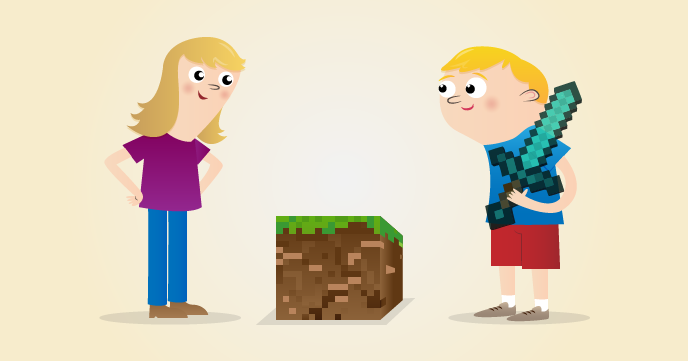

# Guia de inicio para programar el mundo de Minecraft 

Minecraft es un juego popular de construir mundos. Hay una versión gratuita de Minecraft disponible en la Raspberry Pi y también viene con un interfaz para programar. Esto significa que podemos escribir órdenes y scripts en Python para construir cosas en el juego de forma automática. ¡Es una forma entretenida de aprender Python!

## Requisitos
### Hardware

Este recurso no requiere hardware adicional además de la Raspberry Pi con Raspbian instalado en la tarjeta SD o bien instalar el software necesario en Ubuntu (ver la siguiente sección).

### Software

Minecraft está instalado por defecto en Raspbian desde septiembre de 2014.

Si quieres instalar el software necesario en Ubuntu, mira la página [instalación del software](software.md).

## La práctica inicial

- [La práctica inicial](practicaInicial.md)

## Aprender python programando Minecraft
- [Apender Python](aprende.md) 

## Licencia

A menos que se especifique otra cosa, todo lo que hay en éste repositorio está cubierto por la siguiente liciencia: 

***Minecraft Pi*** by the [Raspberry Pi Foundation](http://www.raspberrypi.org) está licenciado bajo [Creative Commons Attribution 4.0 International Licence](http://creativecommons.org/licenses/by-sa/4.0/).

[Basado en el trabajo de] https://github.com/raspberrypilearning/getting-started-with-minecraft-pi