# Guia para instalar minecraft Pi en Ubuntu

Este documento está basado en [raspberryjammod](https://github.com/arpruss/raspberryjammod)

Se realizará la instalación **single-player**

## Paso 1:
Vamos a [https://minecraft.net/download](https://minecraft.net/download) , descargamos la versión para linux y la ejecutamos una vez pulsando doble click. 
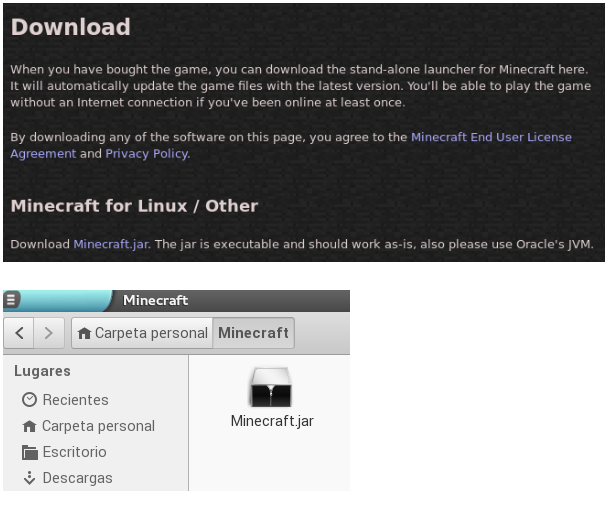

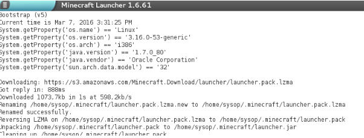

Si no estamos registrados, pulsamos el botón *Register* y nos damos de alta en la web de mojang:

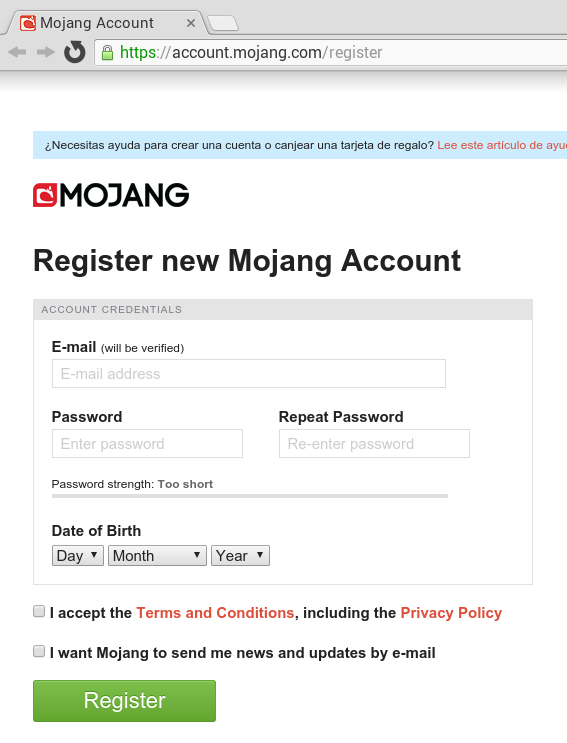

Ahora ya podemos identificarnos:

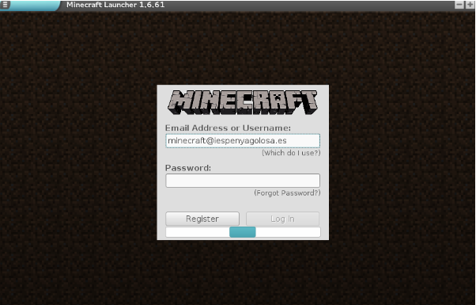

A continuación editamos el perfil (botón Edit Profile) y escogemos la versión de Minecraft 1.8.9 ( o una versión más reciente que coincida con la de Forge que descargaremos en el paso 2):

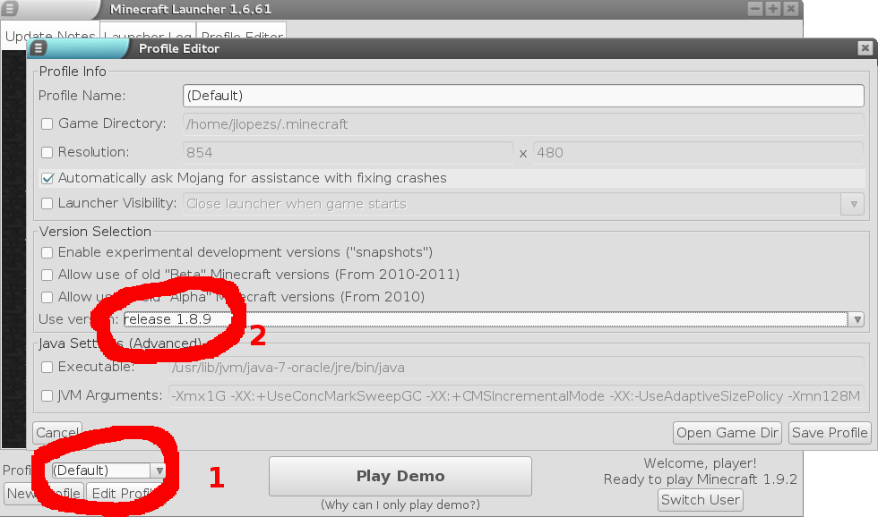

Le damos al botón **Play Demo** y comprobamos que podemos jugar en el mundo existente o creandonos uno nuevo.

Salimos de Minecraft.

## Paso 2:
Descargamos e instalamos la ultima versión de Minecraft Forge para 1.8 (o más reciente que coincida con la de minecraft que hemos elegido antes) desde [http://files.minecraftforge.net/](http://files.minecraftforge.net/)

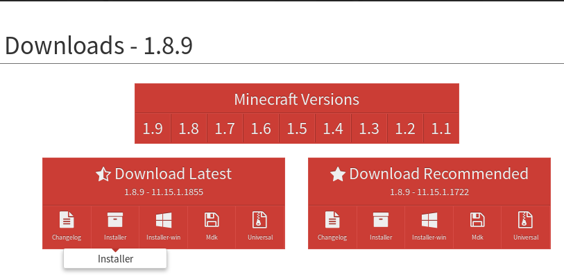

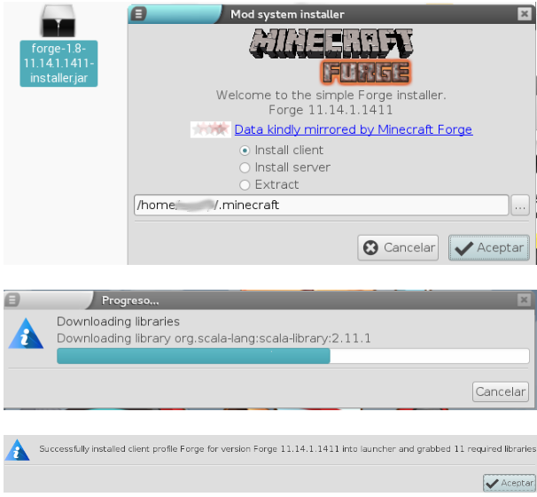

Iniciamos de nuevo Minecraft, pero ahora cambiamos el perfil a **Forge**: 

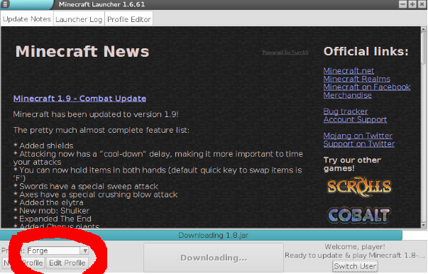

## Paso 3:
Descargamos el fichero [python-scripts.zip](https://github.com/arpruss/raspberryjammod/releases) y lo descomprimimos

Copiamos la carpeta **python3scripts/mcpi** en nuestra carpeta .minecraft.

Descargamos el archivo [mods.zip](https://github.com/arpruss/raspberryjammod/releases) y lo extraemos. Vamos a la carpeta **.minecraft**, escogemos el archivo **RaspberryJamMod.jar** y lo copiamos  en la carpeta **.minecraft/mods**.

Al final de este paso, la carpeta **.minecraft** tendrá éste aspecto:

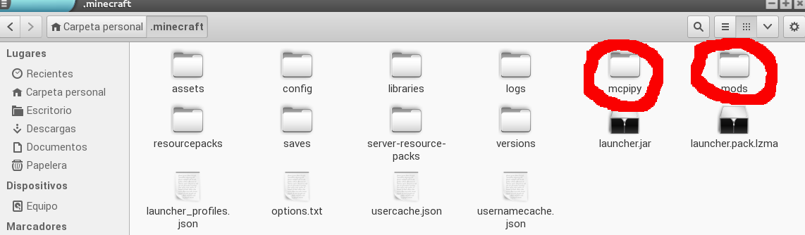

Volvemos a abrir minecraft, creamos un mundo nuevo en modo creativo y jugamos en él.

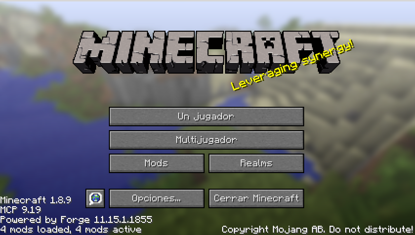

## Paso 4:
Instalamos **idle3**

Para ello debemos activar los repositorios de ubuntu: 
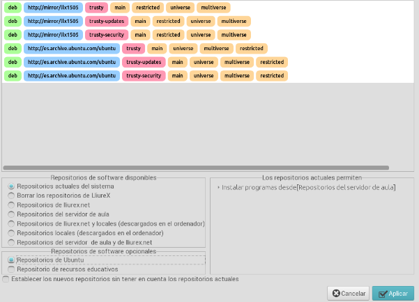

```bash
sudo apt-get install idle3
```

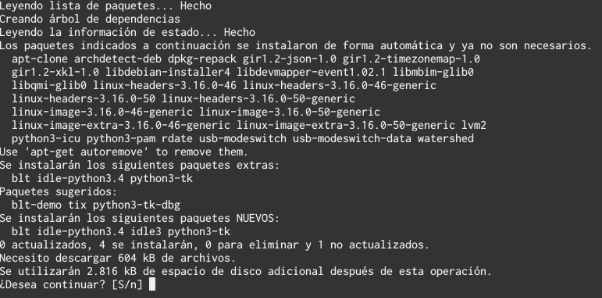

Lanzamos idle3 desde **Aplicaciones-->Programación** y cargamos algún fichero de ejemplo (carpeta .minecraft/mcpi) 

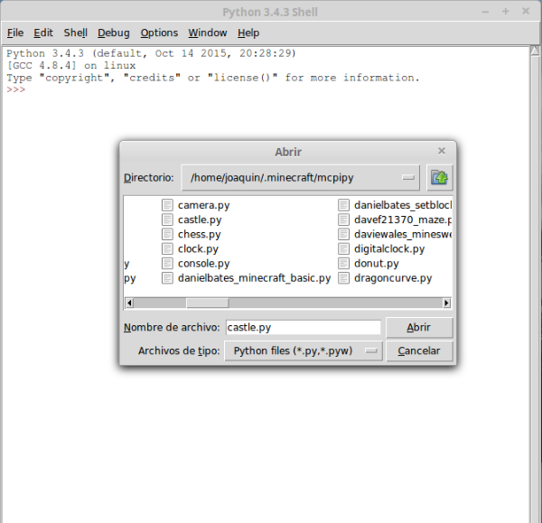

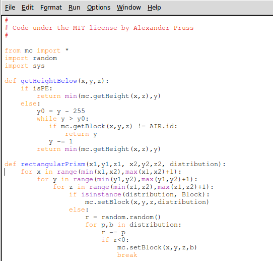

Al pulsar en la tecla **F5**, se cargará el programa en la pantalla de minecraft: 

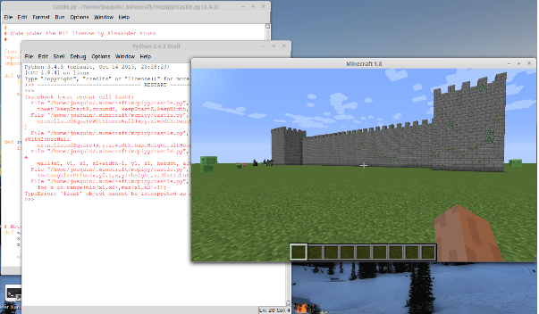

A partir de ahora podemos ejecutar nuestros programas escritos en python para minecraft :-) 

## Paso 5:
¿Y ahora qué?

Puedes ir al siguiente enlace para ver los [primeros pasos] (https://jolosan.github.io/minecraft/practicaInicial.html) en el mundo de Minecraft.

También puedes aprender python programando Minecraft [siguiendo este curso] (https://jolosan.github.io/minecraft/aprende.html)

¡Adelante! 
