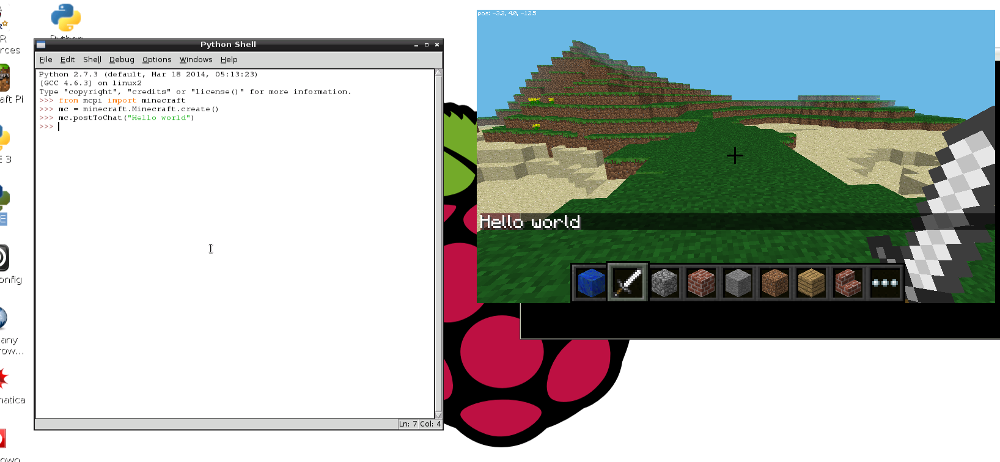

# Práctica inicial para programar el mundo de Minecraft 

Minecraft es un juego popular de construir mundos. Hay una versión gratuita de Minecraft disponible en la Raspberry Pi y también viene con un interfaz para programar. Esto significa que podemos escribir órdenes y scripts en Python para construir cosas en el juego de forma automática. ¡Es una forma entretenida de aprender Python!


## Ejecutar Minecraft

Para ejecutar Minecraft haz doble click sobre el icono del escritorio o escribe `minecraft-pi` en el terminal.


Cuando se haya cargado Minecraft Pi, haz click en **Start Game**, seguido de **Create new**. Notarás que la ventana que lo contiene se desplaza ligeramente. Esto significa que para arrastrar la ventana alrededor del escritorio, debemos coger la barra de título de detrás de la ventana de Minecraft.


¡Ahora estás en el juego de Minecraft!
¡Da un paseo, destruye cosas y construye cosas!

Usa en ratón para mirar alrededor y las siguuientes teclas del teclado: 

| Tecla         | Acción                     |
| :---:         | :-----:                    |
| W             | Adelante                   |
| A             | Izquierda                  |
| S             | Atrás                      |
| D             | Derecha                    | 
| E             | Inventario                 |
| Espacio       | Saltar                     |
| Doble Espacio | Volar / Caer               |
| Esc           | Pausa / Menu del juego     |
| Tab           | Libera el cursor del ratón |

Puedes elegir un ítem del panel de dibujo rápido con la rueda del ratón (o usar los números de tu teclado), o pulsar
`E` y seleccionar algo de tu inventario.


También puedes pulsar dos veces la barra espaciadora para volar en el cielo. Dejarás de volar cuando sueltes la barra espaciadora y si vuelves a pulsarla dos veces, volverás al suelo. 


Con la espada en tu mano, puedes hacer click en bloques enfrente tuya para eliminarlos (o para excavar). Con un bloque en tu mano, puedes hacer click con el botón derecho para poner ese bloque enfrente tuya, o click con el botón izquierdo para quitar un bloque.

## Usa el interfaz de programación de Python

Con Minecraft en ejecución, y el mundo creado, quitamos el foco del juego pulsando la tecla `Tab`, así habremos liberado el ratón. Abre IDLE3 en el escritorio y mueve las ventanas para poner una al lado de la otra.

Ahora puedes introducir las órdenes directamente en la ventana de Python o crear un fichero para guardar el programa y ejecutarlo en otra ocasión.

Si quieres crear un fichero, ve a `Archivo > Nueva ventana` y `Archivo > Guardar`. Probablemente querrás guardarlo en tu carpeta personal o en una carpeta de proyectos.

Empieza importando la librería de Minecraft, creando una conexión con el juego y probándolo escribiendo el típico mensaje "Hello world" en la pantalla:

```python
from mcpi import minecraft

mc = minecraft.Minecraft.create()

mc.postToChat("Hello world")
```

Si estás escribiendo órdenes directamente en la ventana de Python, únicamente pulsa `Intro` después de cada línea. Si es un fichero, guárdalo con `Ctrl + S` y ejecutalo con `F5`. Cuando se ejecuta el código, deberías ver tu mensaje en la pantalla del juego.



### Encuentra tu ubicación

Para encontrar tu ubicación, escribe:

```python
pos = mc.player.getPos()
```

Ahora la variable `pos` contiene tu ubicación, puedes acceder a cada parte del conjunto de coordenadas con `pos.x`, `pos.y` y `pos.z`.

Alternativamente, una forma limpia de obtener las coordenadas en variables separadas es usar la técnica de separación de Python:

```python
x, y, z = mc.player.getPos()
```

Ahora las variables `x`, `y`, y `z` contienen cada parte de las coordenadas de tu posición. `x` y `z` son las direcciones de caminar (adelante/atrás e izquierda/derecha) e `y` es arriba/abajo.

Date cuenta que `getPos()` devuelve la ubicación del jugador en el momento, por tanto, si cambias de posición, deberás llamar de nuevo a la función o usar la ubicación que habías guardado.

### Teletransportarte

Además de encontrar tu ubicación actual, puedes especificar una ubicación particular para teletransportarte a ella. 

```python
x, y, z = mc.player.getPos()
mc.player.setPos(x, y+100, z)
```
Esta instrucción transportará al jugador 100 espacios en el aire. Esto significará que serás transportado a mitad del cielo y caerás donde habías empezado.

¡Intenta teletransportarte a cualquier otro lugar!

### Pon un bloque

Puedes poner un único bloque en unas coordenadas concretas con `mc.setBlock()`:

```python
x, y, z = mc.player.getPos()
mc.setBlock(x+1, y, z, 1)
```
Ahora debería aparecer un bloque de piedra junto donde está el jugador. Si no está inmediatamente enfrente, puede estar al lado o detrás del jugador. Vuelve a la ventana de Minecraft y usa el ratón para mirar alrededor tuyo hasta que veas un bloque gris directamente enfrente tuyo.


Los argumentos que se pasan a  `set block` son `x`, `y`, `z` y `id`. Los `(x, y, z)` hacen referencia a la posición en el mundo (hemos especificado un bloque de distancia desde donde se encuentra el jugador con (`x + 1`) y el `id` hace referencia al tipo de bloque que queremos poner. `1` es piedra.

Otros bloques que puedes probar:

```
Aire:   0
Césped: 2
Suciedad:  3
```

Ahora con el bloque a la vista, intenta cambiarlo a otra cosa:

```python
mc.setBlock(x+1, y, z, 2)
```

¡Deberías ver un cambio en el bloque de piedra gris frente a tus ojos!


#### Constantes de bloque

Puedes usar constantes de bloque definidas si sabes su nombre. Necesitarás escribir otra línea `import`.

```python
from mcpi import block
```

Ahora puedes poner un bloque de la siguiente manera: 

```python
mc.setBlock(x+3, y, z, block.STONE.id)
```

Los id (identificadores) de bloque son bastante fáciles de adivinar, únicamente usa las mayúsculas, pero aquí hay algunos ejemplos para que te acostumbres a la forma en que se nombran.

```
WOOD_PLANKS
WATER_STATIONARY
GOLD_ORE
GOLD_BLOCK
DIAMOND_BLOCK
NETHER_REACTOR_CORE
```

### Bloque como variable

Si conoces el id de un bloque, puede ser útil para utilizarlo como variable. Puedes usar el nombre o el id entero. 

```python
dirt = 3
mc.setBlock(x, y, z, dirt)
```

o

```python
dirt = block.DIRT.id
mc.setBlock(x, y, z, dirt)
```

### Bloques especiales

Hay algunos bloques que tienen propiedades extra, como Wool que tiene una configuración extra como el color.
Para ponerlo, usa el cuarto parámetro opcional en `setBlock`:

```python
wool = 35
mc.setBlock(x, y, z, wool, 1)
```
Aquí el cuarto parámetro `1` configura el color de wool como naranja. Sin el cuarto parámetro, el color sería por defecto (`0`) que es blanco. Algunos colores son:

```
2: Magenta
3: Light Blue
4: Yellow
```
¡Prueba otros números y observa el cambio del bloque!

Otros bloques que tienen propiedades extra son madera (`17`): roble, abeto, abedul, etc; hierba alta (`31`): arbusto, césped, helecho; antorcha (`50`): apuntando al este, oeste, norte, sur y más. Mira la [referencia API](http://www.stuffaboutcode.com/p/minecraft-api-reference.html) para más detalles.

### Poner múltiples bloques

Así como para poner un único bloque utilizamos `setBlock` podemos rellenar un volumen de espacio de una vez con `setBlocks`:

```python
stone = 1
x, y, z = mc.player.getPos()
mc.setBlocks(x+1, y+1, z+1, x+11, y+11, z+11, stone)
```

Esto rellenará un cubo de 10 x 10 x 10 de piedra sólida.


¡Puedes crear volúmenes más grandes con la función `setBlocks` pero tardará más en generarse!

## Soltar bloques tal como vamos caminando

Ahora que ya sabes como soltar bloques, vamos a usar nuestra ubicación en movimiento para soltar bloques cuando caminamos.

El código siguiente soltará una flor detrás nuestra a cualquier lugar que caminemos:

```python
from mcpi.minecraft import Minecraft
from time import sleep

mc = Minecraft.create()

flower = 38

while True:
    x, y, z = mc.player.getPos()
    mc.setBlock(x, y, z, flower)
    sleep(0.1)
```

Ahora camina hacia adelante un poco y gírate para ver las flores que has dejado detrás tuyo. 


Dado que hemos usado un bucle `while True` esto se ejecutará indefinidamente. Para pararlo, pulsa `Ctrl + C` en la ventana de Python.

Prueba a volar en el aire y observa las flores que dejas en el cielo:


¿Y si únicamente quisiéramos soltar flores cuando el jugador camina sobre césped? Podemos usar `getBlock` para averiguar qué tipo de bloque es:

```python
x, y, z = mc.player.getPos()  # posición del jugador (x, y, z)
this_block = mc.getBlock(x, y, z)  # ID del bloque
print(this_block)
```

Esto nos dice la ubicación del bloque *en* el que estamos situados (esta será `0` - un bloque de aire). Queremos saber el tipo de bloque *sobre* el que estamos situados. Para ello restamos 1 del valor `y` y usamos `getBlock()` para determinar el tipo de bloque sobre el que estamos:

```python
x, y, z = mc.player.getPos()  # posición del jugador (x, y, z)
block_beneath = mc.getBlock(x, y-1, z)  # ID del bloque
print(block_beneath)
```

Esto nos dice el ID del bloque sobre el que está situado el jugador.

Prueba ésto ejecutando un bucle para escribir el ID de cualquier bloque sobre el que estés situado:

```python
while True:
    x, y, z = mc.player.getPos()
    block_beneath = mc.getBlock(x, y-1, z)
    print(block_beneath)
```


Podemos usar la instrucción `if` para determinar si plantamos una flor o no: 

```python
grass = 2
flower = 38

while True:
    x, y, z = mc.player.getPos()  # posición del jugador (x, y, z)
    block_beneath = mc.getBlock(x, y-1, z)  # ID del bloque

    if block_beneath == grass:
        mc.setBlock(x, y, z, flower)
    sleep(0.1)
```

Quizás podráimos cambiar la baldosa sobre la que estamos en césped si todavía no es césped:


```python
if block_beneath == grass:
    mc.setBlock(x, y, z, flower)
else:
    mc.setBlock(x, y-1, z, grass)
```

Ahora podemos caminar hacia adelante sobre césped, dejaremos una flor detrás. Si el bloque siguiente no es césped, lo cambia a césped. Cuando giramos y caminamos de vuelta, dejamos una flor detrás nuestra.


## Jugando con los bloques TNT 

¡Otro bloque interesante es TNT! Para poner un bloque normal TNT usa:

```python
tnt = 46
mc.setBlock(x, y, z, tnt)
```


Sin embargo, este bloque TNT es bastante aburrido. Intenta poner `data` como `1`:

```python
tnt = 46
mc.setBlock(x, y, z, tnt, 1)
```

Ahora usa tu espada y haz click con el botón izquierdo del ratón en el bloque TNT: ¡se activará y explotará en cuestión de segundos!

¡Ahora intenta crear un cubo grande de bloques TNT!

```python
tnt = 46
mc.setBlocks(x+1, y+1, z+1, x+11, y+11, z+11, tnt, 1)
```


Ahora verás un gran cubo lleno de bloques TNT. ¡Ve y activa uno de los bloques y corre lejos para ver el show!
Será realmente lento renderizar los gráficos porque están ocurriendo muchas cosas a la vez.


## Diversión con lava fluyendo.

Un bloque que es muy divertido para jugar es el de lava fluyendo.

```python
from mcpi.minecraft import Minecraft

mc = Minecraft.create()

x, y, z = mc.player.getPos()

lava = 10

mc.setBlock(x+3, y+3, z, lava)
```

Busca el bloque que acabas de poner y verás como fluye la lava desde el bloque hacia el suelo. 

Lo fascinante de la lava es que cuando se enfría se convierte en roca. Muévete a otra ubicación en tu mundo e intenta esto: 


```python
from mcpi.minecraft import Minecraft
from time import sleep

mc = Minecraft.create()

x, y, z = mc.player.getPos()

lava = 10
water = 8
air = 0

mc.setBlock(x+3, y+3, z, lava)
sleep(20)
mc.setBlock(x+3,y+5, z, water)
sleep(4)
mc.setBlock(x+3, y+5, z, air)

```

Puedes ajustar los parámetros de `sleep` para dejar que fluya más o menos lava.


## ¿Y ahora qué?

Hay muchas cosas que puedes hacer ahora que sabes moverte por el mundo Minecraft y como usar el interfaz de Python.

### Jugar en red

Si varias personas conectan las Raspberry Pi a una red local, pueden unirse al mismo mundo Minecraft y jugar juntos. Los jugadores pueden verse entre ellos en el mundo de Minecraft.

### Referencia API 

Para una documentación más extensa de las funciones y una lista completa de los IDs de los bloques, pudes ver una referencia de la API en [stuffaboutcode.com](http://www.stuffaboutcode.com/p/minecraft-api-reference.html).

### Crea un juego

Prueba otro recurso y haz un juego Whac-a-mole (golpea los topos): [Minecraft Whac-a-Block](https://www.raspberrypi.org/learning/minecraft-whac-a-block-game/).
