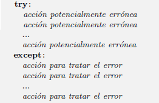
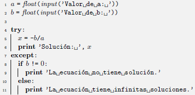
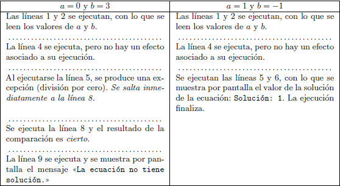
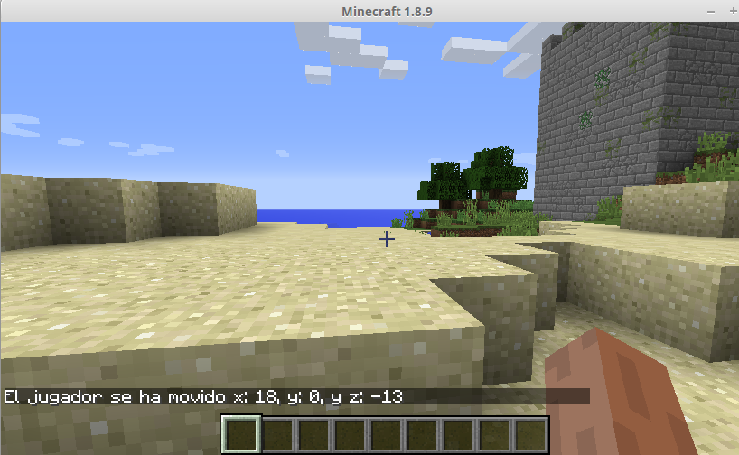

# 3. Entrada/Salida

Para ser capaces de escribir programas útiles, debemos ser capaces de leer entradas, por ejemplo de la consola (teclado) y de ficheros, y producir salidas, tanto a la consola (pantalla) como a ficheros.

## 3.1. Salida

Una de las funciones más utilizadas es **print()**.

```python
print("Hola")
print()
print("Adios")
```

La función **print()** permite incluir variables o expresiones como argmento, lo que nos permite combinar texto y variables:

```python
nombre = "Pepe"
edad = 25
print("Me llamo", nombre, "y tengo", edad, "años.")

```
## 3.2. Entrada

Python proporciona la función **input()** para aceptar entradas por parte del usuario.

```python
print("¿Cómo se llama?")
nombre = input()
print("Me alegro de conocerle,", nombre)
```

Otra forma de obtener el mismo resultado sería:

```python
nombre = input("¿Cómo se llama? ")
print("Me alegro de conocerle,", nombre)
```

### 3.2.1. Conversión de tipos

De forma predeterminada, la función **input()** convierte la entrada en una cadena. Si se quiere que Python interprete la entrada como un número entero, se debe utilizar la función **int()** de la siguiente manera:

```python
cantidad = int(input("Dígame una cantidad en pesetas: "))
print(cantidad, "pesetas son", cantidad / 166.386, "euros")
```


En caso de querer concatenar cadenas y números, se debe utilizar la función **str()**:

```python
numero1 = int(input("Dígame un número: "))
numero2 = int(input("Dígame un número mayor que " + str(numero1) +  ": "))
print("La diferencia entre ellos es", numero2 - numero1)
```

### 3.2.2. Manejo de excepciones
Existe forma adicional de alterar el flujo de control que permite señalar, detectar y tratar los errores que se producen al ejecutar un programa. Son las sentencias de emisión y captura de excepciones.

Hay una estructura de control especial para la detección y tratamiento de excepciones: try-except. Su forma básica de uso es ésta: 



Vemos un ejemplo de su uso mediante la resolución de una ecuación de primer grado:



Las líneas 5 y 6 están en un bloque que depende de la sentencia try. Veamos ejemplos de su ejecución: 




Veamos un ejemplo más elaborado:

```python
print ("Introduce enteros, cada uno seguido de un Intro; o sólo Intro para finalizar")
total = 0
contador = 0
while True:
	linea = input("Entero: ")
	if linea:
		try:
			numero = int(linea)
		except ValueError as err:
			print(err)
			continue
		total += numero
		contador +=1
	else:
		break

if contador:
	print(" contador = ", contador, "total = ", total, "media = ", total/contador) 
```

Aunque el programa es muy corto, es bastante robusto. Si el usuario introduce una cadena que no puede ser convertida a entero, el problema es capturado por un manejador de excepciones que muestra el mensaje apropiado y cambia el control al inicio del bucle.

Una forma sencilla de crear ficheros es redirigiendo la salida de las funciones **print()** desde la consola. Por ejemplo: 

```bash
test.py > resultados.txt
```

Leer datos de un fichero puede conseguirse redirigiendo un fichero de datos como entrada de una forma análoga a la redirección de la salida. Sin embargo, habrá que modificar el programa anterior para que no de error al llegar al caracter de final de fichero (EOF)

```python
print ("Introduce enteros, cada uno seguido de un Intro; o ^D o ^Z para finalizar")
total = 0
contador = 0
while True:
	try:
    	linea = input()
    	if linea:
      		numero = int(linea)
			total += numero
			contador +=1
	except ValueError as err:
		print(err)
		continue
	except EOFError:
		break

if contador:
	print(" contador = ", contador, "total = ", total, "media = ", total/contador)
```

Este programa funcionaría de la siguiente forma:

(*datos.dat* es un fichero de texto plano que contiene una lista de números, uno por línea)

```bash
sum2.py < datos.dat 
```

## 3.3. Práctica con Minecraft

### 3.3.1. Hola, Mundo Minecraft

En el siguiente ejemplo se muestra como usar python para enviar un mensaje al mundo de Minecraft.

```python
from mcpi import minecraft
mc = minecraft.Minecraft.create()

mc.postToChat("Hola, Mundo Minecraft")
```

### 3.3.2. Escribe tu propio mensaje

El siguiente programa almacena en la variable *mensaje* el texto recibido por la función *input()*

```python
from mcpi import minecraft
mc = minecraft.Minecraft.create()
mensaje = input("Introduce tu mensaje: ")
mc.postToChat(mensaje)
```

### 3.3.3. Crea un bloque cuyo tipo indicarás como entrada

```python
from mcpi import minecraft
mc = minecraft.Minecraft.create()

tipoDeBloque = int(input("Introduce un tipo de bloque: "))
pos = mc.player.getTilePos()
x = pos.x
y = pos.y
z = pos.z

mc.setBlock(x, y, z, tipoDeBloque)
```

### 3.3.4. Tratamiento de excepciones (sólo se permiten números)

Para tratar los errores o excepciones en la entrada del tipo de bloque, hemos de cambiar la línea del *input()* del programa anterior por el siguiente código:

```python
try:
    tipoDeBloque = int(input("Introduce un tipo de bloque:  "))
    mc.setBlock(x, y, z, tipoDeBloque)
except:
    mc.postToChat("¡No has introducido un número!¡La próxima vez introduce un número.")
```

### 3.3.5. Muestra el cambio de coordenadas del jugador 

En el siguiente ejemplo el programa calcula la distancia que recorre en jugador en 10 segundos y lo muestra en la pantalla del mundo.

```python
from time import sleep
from mcpi import minecraft

mc = minecraft.Minecraft.create()

pos1 = mc.player.getTilePos()
x1 = pos1.x
y1 = pos1.y
z1 = pos1.z

time.sleep(10)

pos2 = mc.player.getTilePos()
x2 = pos2.x
y2 = pos2.y
z2 = pos2.z

# Compara la diferencia entre la posición de inicio y la del final
distanciaX = x2 - x1
distanciaY = y2 - y1
distanciaZ = z2 - z1

# Muestra los resultados en la ventana de Minecraft
mc.postToChat("El jugador se ha movido x: " + str(distanciaX) + ", y: "
    + str(distanciaY) + ", y z: " + str(distanciaZ))
```



[Vuelve al índice](https://jolosan.github.io/minecraft/aprende.html)
