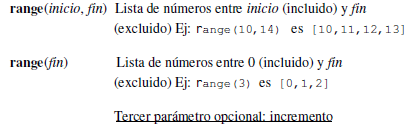

# 5. Bucles


## 5.1. while

El bucle *while* (mientras) ejecuta un fragmento de código mientras se cumpla una condición.

```python
    edad = 0
    while edad < 18:
    	edad = edad + 1
    print "Felicidades, tienes " + str(edad) 
```

La variable *edad* comienza valiendo 0. Como la condición de que *edad* es menor que 18 es cierta (0 es menor que 18), se entra en el bucle. El bucle se ejecutará mientras que *edad* sea menor que 18, momento en el cual la condición dejará de cumplirse y el programa continuaría ejecutando las instrucciones siguientes al bucle.

**Bucles infinitos y su rotura:**

Hay situaciones en las que un bucle infinito es útil. Por ejemplo, veamos un pequeño programa que repite todo lo que el usuario diga hasta que escriba adios.

```python
    while True:
    	entrada = raw_input(“> “)
   		if entrada == "adios":
    		break
    	else:
    		print entrada 
```

La palabra clave *break* (romper) sale del bucle en el que estamos.

Otra palabra clave que nos podemos encontrar dentro de los bucles es *continue* (continuar). Lo que hace es pasar directamente a la siguiente iteración del bucle.

```python
    edad = 0
    while edad < 18:
    	edad = edad + 1
    	if edad % 2 == 0:
   			continue
    print "Felicidades, tienes " + str(edad) 
```

## 5.2. for … in

Este es el aspecto de un bucle *for* en Python:

```python
    secuencia = ["uno", "dos", "tres"]
    for elemento in secuencia:
    	print elemento 
```

Lo que hace la cabecera del bucle es obtener el siguiente elemento de la secuencia secuencia y almacenarlo en una variable de nombre elemento. Por esta razón en la primera iteración del bucle elemento valdrá "uno", en la segunda "dos", y en la tercera "tres".

Podemos utilizar la funcion range: 



Por ejemplo:

```python
    range(10,20,3) es [10,13,16,19]
```

En el siguiente ejemplo se ve el uso de la función **range()** y de una variable que hace de contador:

```python
print("Comienzo")
cuenta = 0
for i in range(1, 6):
    if i % 2 == 0:
        cuenta = cuenta + 1
print("Desde 1 hasta 5 hay", cuenta, "múltiplos de 2")
```

## 5.3. Práctica con Minecraft

### 5.3.1. Teletransporte aleatorio

Copia el siguiente código en un archivo nuevo desde IDLE y guárdalo con el nombre *teletransporteAleatorio.py*
Prueba a ejecutarlo y trata de entenderlo.

```python
import time
import random
from mcpi.minecraft import Minecraft
mc = Minecraft.create()

cuenta = 0
while cuenta < 5:
    x = random.randrange(-127, 128)
    y = random.randrange(0, 64)
    z = random.randrange(-127, 128)

    mc.player.setTilePos(x, y, z)
    cuenta += 1
    time.sleep(10)
```

### 5.3.2. Camino de flores

Copia el siguiente código en un archivo nuevo desde IDLE y guárdalo con el nombre *caminoDeFlores.py*
Prueba a ejecutarlo y trata de entenderlo.

```python
from mcpi.minecraft import Minecraft
mc = Minecraft.create()

import time

while True:
    pos = mc.player.getPos()
    mc.setBlock(pos.x, pos.y, pos.z, 38)
    time.sleep(0.2)
```

### 5.3.3. Resistencia bajo el agua

Copia el siguiente código en un archivo nuevo desde IDLE y guárdalo con el nombre *resistenciaBucenado.py*
El jugador bucea tanto tiempo como puede. El programa contará los segundos que el jugador está bajo el agua, y al finalizar mostrará el récord.
Prueba a ejecutarlo y trata de entenderlo.

```python
from mcpi.minecraft import Minecraft
mc = Minecraft.create()
import time

record = 0
pos = mc.player.getPos()
bloqueEncima = mc.getBlock(pos.x, pos.y + 2, pos.z)

# repite el siguiente código mientras el bloque de encima es agua (8) o agua corriente (9)
while bloqueEncima == 8 or bloqueEncima == 9:
    # espera 1 segundo
    time.sleep(1)
    pos = mc.player.getPos()
    bloqueEncima = mc.getBlock(pos.x, pos.y + 2, pos.z)
    record = record + 1
    # muestra el record actual
    mc.postToChat("Récord actual: " + str(record))
    
    
# muestra el record final después del bucle
mc.postToChat("Récord record: " + str(record))
# Usa una instrucción condicional para comprobar si el record es mayor que 6
if record > 6:
    # crea flores encima de el para celebrarlo
    posFinal = mc.player.getTilePos()
    mc.setBlocks(posFinal.x - 5, posFinal.y + 10, posFinal.z - 5,
                 posFinal.x + 5, posFinal.y + 10, posFinal.z + 5, 38)
```

### 5.3.5. Crea una pista de baile

Copia el siguiente código en un archivo nuevo desde IDLE y guárdalo con el nombre *pistaDeBaile.py*
Este programa crea una pista de baile que cambia de color cada 5 segundos si el jugador está sobre ella
Prueba a ejecutarlo y trata de entenderlo.

```python
from mcpi.minecraft import Minecraft
mc = Minecraft.create()
import time

pos = mc.player.getTilePos()
sueloX = pos.x - 2
sueloY = pos.y - 1
sueloZ = pos.z - 2
anchura = 5
longitud = 5
bloque = 41
mc.setBlocks(sueloX, sueloY, sueloZ,
             sueloX + anchura, sueloY, sueloZ + longitud, bloque)

while sueloX <= pos.x <= sueloX + anchura and sueloZ <= pos.z <= sueloZ + longitud:
    if bloque == 41:
        bloque = 57
    else:
        bloque = 41
    mc.setBlocks(sueloX, sueloY, sueloZ,
                 sueloX + anchura, sueloY, sueloZ + longitud, bloque)
    # obtén la posición del jugador
    pos = mc.player.getTilePos()
    # espera 0.5 segundos
    time.sleep(0.5)
```

### 5.3.5. Introduce mensajes hasta escribir salir

Copia el siguiente código en un archivo nuevo desde IDLE y guárdalo con el nombre *escribeMensajes.py*
Veras como salir de un bucle con *break*.
Prueba a ejecutarlo y trata de entenderlo.

```python
from mcpi.minecraft import Minecraft
mc = Minecraft.create()

nombreUsuario = input("Introduce tu mensaje: ")

while True:
    mensaje = input("Introduce tu mensaje: ")
    if mensaje == "salir":
        break
    mc.postToChat(nombreUsuario + ": " + mensaje)
```

### 5.3.6. Frío caliente

Copia el siguiente código en un archivo nuevo desde IDLE y guárdalo con el nombre *frioCaliente.py*
Deberás de encontrar y ponerte encima de un bloque de tipo diamante que ha sido ubicado de manera aleatoria en el mundo
Prueba a ejecutarlo y trata de entenderlo.

```python
from mcpi.minecraft import Minecraft
import math
import time
import random
mc = Minecraft.create()

destX = random.randint(-127, 127)
destZ = random.randint(-127, 127)
destY = mc.getHeight(destX, destZ)

print(destX, destY, destZ)

bloque = 57 # diamante
mc.setBlock(destX, destY, destZ, bloque)
mc.postToChat("Bloque ubicado")

while True:
    pos = mc.player.getPos()
    distancia = math.sqrt((pos.x - destX) ** 2 + (pos.z - destZ) ** 2)
     # Calcula la distancia al bloque de diamante
    if distancia == 0:
        break

    if distancia > 100:
        mc.postToChat("Te congelas")
    elif distancia > 50:
        mc.postToChat("Frío")
    elif distancia > 25:
        mc.postToChat("Caliente")
    elif distancia > 12:
        mc.postToChat("Hirviendo")
    elif distancia > 6:
        mc.postToChat("¡Te quemas!")
    elif distancia == 0:
        mc.postToChat("Lo encontraste")
```

### 5.3.7. Escaleras mágicas

Copia el siguiente código en un archivo nuevo desde IDLE y guárdalo con el nombre *escalerasMagicas.py*
Prueba a ejecutarlo y trata de entenderlo.

```python
from mcpi.minecraft import Minecraft
mc = Minecraft.create()

pos = mc.player.getTilePos()
x, y, z = pos.x, pos.y, pos.z

bloqueEscalera = 53

for escalon in range(10):
    mc.setBlock(x + step, y + step, z, bloqueEscalera)
```

### 5.3.8. Pilares

Copia el siguiente código en un archivo nuevo desde IDLE y guárdalo con el nombre *pilares.py*
Prueba a ejecutarlo y trata de entenderlo.

```python
from mcpi.minecraft import Minecraft
mc = Minecraft.create()


def creaPilar(x, y, z, altura):
    """Crea un pilar. Los argumentos son posición y altura del pilar"""
    bloqueEscalon = 156
    bloque = 155

    # Parte de arriba del pilar
    mc.setBlocks(x - 1, y + altura, z - 1, x + 1, y + altura, z + 1, bloque, 1)
    mc.setBlock(x - 1, y + altura - 1, z, bloqueEscalon, 12)
    mc.setBlock(x + 1, y + altura - 1, z, bloqueEscalon, 13)
    mc.setBlock(x, y + altura - 1, z + 1, bloqueEscalon, 15)
    mc.setBlock(x, y + altura - 1, z - 1, bloqueEscalon, 14)

    # Parte de la base del pilar
    mc.setBlocks(x - 1, y, z - 1, x + 1, y, z + 1, bloque, 1)
    mc.setBlock(x - 1, y + 1, z, bloqueEscalon, 0)
    mc.setBlock(x + 1, y + 1, z, bloqueEscalon, 1)
    mc.setBlock(x, y + 1, z + 1, bloqueEscalon, 3)
    mc.setBlock(x, y + 1, z - 1, bloqueEscalon, 2)

    # columna del pilar
    mc.setBlocks(x, y, z, x, y + altura, z, bloque, 2)

pos = mc.player.getTilePos()
x, y, z = pos.x + 2, pos.y, pos.z

for desplazamientoX in range(0, 100, 5):
    creaPilar(x + desplazamientoX, y, z, 10)
```

### 5.3.9. Pirámide

Copia el siguiente código en un archivo nuevo desde IDLE y guárdalo con el nombre *piramide.py*
Prueba a ejecutarlo y trata de entenderlo.

```python
from mcpi.minecraft import Minecraft
mc = Minecraft.create()


bloque = 24  # piedra de arena
altura = 10
niveles = reversed(range(altura))

pos = mc.player.getTilePos()
x, y, z = pos.x + altura, pos.y, pos.z

for nivel in niveles:
    mc.setBlocks(x - nivel, y, z - nivel, x + nivel, y, z + nivel, bloque)
    y += 1
```

### 5.3.10. Arcoiris

Copia el siguiente código en un archivo nuevo desde IDLE y guárdalo con el nombre *arcoiris.py*
Prueba a ejecutarlo y trata de entenderlo.

```python
from mcpi.minecraft import Minecraft
mc = Minecraft.create()

listaUnidimensionalArcoiris = [0, 1, 2, 3, 4, 5]
pos = mc.player.getTilePos()
x = pos.x
y = pos.y
z = pos.z

for color in listaUnidimensionalArcoiris:
    mc.setBlock(x, y, z, 35, color)
    y += 1
```

### 5.3.11. PixelArt

Copia el siguiente código en un archivo nuevo desde IDLE y guárdalo con el nombre *pixelArt.py*
Prueba a ejecutarlo y trata de entenderlo.

```python
from mcpi.minecraft import Minecraft
mc = Minecraft.create()

pos = mc.player.getTilePos()
x, y, z = pos.x, pos.y, pos.z

bloques = [[35, 35, 22, 22, 22, 22, 35, 35],
          [35, 22, 35, 35, 35, 35, 22, 35],
          [22, 35, 22, 35, 35, 22, 35, 22],
          [22, 35, 35, 35, 35, 35, 35, 22],
          [22, 35, 22, 35, 35, 22, 35, 22],
          [22, 35, 35, 22, 22, 35, 35, 22],
          [35, 22, 35, 35, 35, 35, 22, 35],
          [35, 35, 22, 22, 22, 22, 35, 35]]

for fila in reversed(bloques):
    for bloque in fila:
        mc.setBlock(x, y, z, bloque)
        x += 1
    y += 1
    x = pos.x
```

### 5.3.12. Cubo

Copia el siguiente código en un archivo nuevo desde IDLE y guárdalo con el nombre *cubo.py*
Prueba a ejecutarlo y trata de entenderlo.

```python
from mcpi.minecraft import Minecraft
mc = Minecraft.create()
pos = mc.player.getTilePos()
x = pos.x
y = pos.y
z = pos.z
cubo = [[[57, 57, 57, 57], [57, 0, 0, 57], [57, 0, 0, 57], [57, 57, 57, 57]],
        [[57, 0, 0, 57], [0, 0, 0, 0], [0, 0, 0, 0], [57, 0, 0, 57]],
        [[57, 0, 0, 57], [0, 0, 0, 0], [0, 0, 0, 0], [57, 0, 0, 57]],
        [[57, 57, 57, 57], [57, 0, 0, 57], [57, 0, 0, 57], [57, 57, 57, 57]]]
xInicial = x
yInicial = y

for profundidad in cubo:
   for altura in reversed(profundidad):
       for bloque in altura:
           mc.setBlock(x, y, z, bloque)
           x += 1
       y += 1
       x = xInicial
    z += 1
    y = yInicial
```

