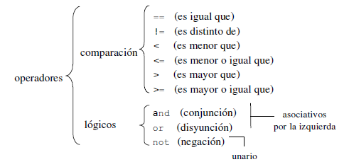
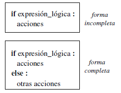

# 4. Condicionales

Los programas más sencillos se forman como una serie de líneas que se ejecutan una tras otra, desde la primera hasta la última y siguiendo el mismo orden con el que aparecen en el fichero: el flujo de ejecución del programa es estrictamente secuencial.
No obstante, es posible alterar el flujo de ejecución de los programas para hacer que:

* tomen decisiones a partir de los datos y/o resultados intermedios y, en función de éstas, ejecuten ciertas sentencias y otras no: sentencias condicionales o de selección.
* tomen decisiones a partir de los datos y/o resultados intermedios y, en función de éstas, ejecuten ciertas sentencias más de una vez: sentencias iterativas o de repetición.

En la siguiente imagen se muestran las expresiones lógicas que podemos usar en Python: 



## 4.1. La sentencia condicional if

La indentación determina de qué sentencia depende cada bloque de sentencias
Las acciones pueden incluir sentencias condicionales (anidamiento de sentencias) 



## 4.1.2. elif

**elif** es una contracción de *else if*. Veamos un ejemplo:

```python
if numero < 0:
	print “Negativo”
elif numero > 0:
	print “Positivo”
else:
	print “Cero”
```

En este ejemplo *elif numero > 0* puede leerse como “si no, si numero es mayor que 0”. Es decir, primero se evalúa la condición del *if*. Si es cierta, se ejecuta su código y se continúa ejecutando el código posterior al condicional; si no se cumple, se evalúa la condición del *elif*. Si se cumple la condición del *elif* se ejecuta su código y se continua ejecutando el código posterior al condicional; si no se cumple y hay más de un *elif* se continúa con el siguiente en orden de aparición. Si no se cumple la condición del *if* ni de ninguno de los *elif*, se ejecuta el código del *else*.


**A if C else B**

También existe una construcción similar al operador ? de otros lenguajes, que no es más que una forma compacta de expresar un *if else*. En esta construcción se evalúa el predicado C y se devuelve A si se cumple o B si no se cumple: *A if C else B*. Veamos un ejemplo:

```python
    var = "par" if (num % 2 == 0) else "impar" 
```

## 4.2. Práctica en Minecraft

### 4.2.1. Explotar un cráter

Copia el siguiente código en un archivo nuevo desde IDLE y guárdalo con el nombre *explotaCrater.py*
Prueba a ejecutarlo y trata de entenderlo.

```python
from mcpi import minecraft
mc = minecraft.Minecraft.create()
respuesta = input("¿Quieres crear un crater? S/N ")

if respuesta == "S":
    pos = mc.player.getPos()
    mc.setBlocks(pos.x + 1, pos.y + 1, pos.z + 1, pos.x - 1, pos.y - 1, pos.z - 1, 0)
    mc.postToChat("¡Boom!")
```

### 4.2.2. Hacer el mundo inmutable

Copia el siguiente código en un archivo nuevo desde IDLE y guárdalo con el nombre *mundoInmutable.py*
Prueba a ejecutarlo y trata de entenderlo.

```python
from mcpi import minecraft
mc = minecraft.Minecraft.create()

respuesta = input("¿Quieres hacer los bloques inmutables S/N ")

if respuesta == "S":
    mc.setting("world_immutable", True)
    mc.postToChat("El mundo no se puede cambiar")
else:
    mc.setting("world_immutable", False)
    mc.postToChat("El mundo se puede cambiar")
```

### 4.2.4. Hacer el mundo inmutable

Copia el siguiente código en un archivo nuevo desde IDLE y guárdalo con el nombre *regalo.py*
Prueba a ejecutarlo y trata de entenderlo.

```python
from mcpi import minecraft
mc = minecraft.Minecraft.create()
x = 10
y = 11
z = 12
regalo = mc.getBlock(x, y, z)

# si el regalo es un bloque de diamante
if regalo == 57:
    mc.postToChat("Gracias por el diamante.")
# sino, si el regalo es un arbusto
elif regalo == 6:
    mc.postToChat("Creo que los arbustos son tan buenos como los diamantes...")
else:
    mc.postToChat("Lleva el regalo a " + str(x) + ", " + str(y) + ", " + str(z))
```

### 4.2.4. Teletransporte al sitio correcto

Copia el siguiente código en un archivo nuevo desde IDLE y guárdalo con el nombre *teletransporteCorrecto.py*
Prueba a ejecutarlo y trata de entenderlo.

```python
from mcpi import minecraft
mc = minecraft.Minecraft.create()

puntos = int(input("Introduce tus puntos: "))
if puntos > 6:
    mc.player.setPos(32, 18, -38)
elif puntos > 4:
    mc.player.setPos(60, 20, 32)
elif puntos > 2:
    mc.player.setPos(112, 10, 112)
elif puntos <= 2:
    mc.player.setPos(0, 12, 20)
else:
    mc.postToChat("No sé que hacer con esa información.")
```

### 4.2.5. Teletransporte al sitio correcto

Copia el siguiente código en un archivo nuevo desde IDLE y guárdalo con el nombre *ducha.py*
Para hacer que funcione la ducha, necesitaremos comprobar unos rangos y operadores booleanos. 
Crearemos una zona de ducha y cuando el jugador camine sobre ella, el agua se activará(bloques de agua)
Prueba a ejecutarlo y trata de entenderlo.

```python
from mcpi import minecraft
mc = minecraft.Minecraft.create()

duchaX = -14
duchaY = 74
duchaZ = 518

anchura = 5
altura = 5
longitud = 5

pos = mc.player.getTilePos()
x = pos.x
y = pos.y
z = pos.z

if duchaX <= x < duchaX + anchura and duchaY <= y < duchaY + altura and duchaZ <= z < duchaZ + longitud:
    mc.setBlocks(duchaX, duchaY + altura, duchaZ,
                 duchaX + anchura, duchaY + altura, duchaZ + longitud, 8)
else:
    mc.setBlocks(duchaX, duchaY, duchaZ,
                 duchaX + anchura, duchaY + altura, duchaZ + longitud, 0)
```

[Vuelve al índice](https://jolosan.github.io/minecraft/aprende.html)
