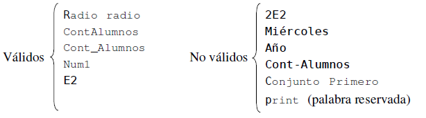

# 1. Elementos Básicos del lenguaje Python
## 1.1. Tipos de datos

Python incorpora varios tipos de datos, aunque de momento nos centraremos en el tipo entero (int) y el tipo cadena (str).

Algunos ejemplos son:
```python
-985
21321321321321321354542185781005415798732135487

"IES xxxxxxxxxx"
'Santiago Segura'
' '
```

El tamaño de los enteros en Python está limitado únicamente por el tamaño de la memoria de la computadora, no ppor un número fijo de bytes como en otros lenguajes de programación.

Las cadenas pueden estar limitadas por comillas simples ('...') o por comillas dobles ("...") . Una cadena vacía simplemente no contiene nada entre las comillas.
Python usa los corchetes ([ ]) para acceder a elementos individuales dentro de una cadena.

Para convertir un tipo de un item en otro podemos usar la sintaxis tipoDeDato(item).

### 1.1.1. Enteros
 Los literales enteros son escritos usando la base 10 (decimal) por defecto, pero también se pueden usar otras base de numeración.

 ```python
>>> 14600926                                # decimal
14600926
>>> 0b110111101100101011011110 				# binario
14600926
>>> 0o67545336                          	# octal
14600926
>>> 0xDECADE                              	# hexadecimal
14600926
```

Todos los operadores numéricos binarios (+, -, /, //, %, y **) tienen versiones de asignación y aumento (+=, -=, /=, //=, %=, y **=) donde  *x op= y* es lógicamente equivalente a *x = x op y*.

La función **int(x)** convierte el objeto x en un entero. Si x es un número decimal, devuelve la parte entera.

Si queremos redondear un número decimal, deberemos usar la función **round()**. 

### 1.1.2. Booleanos
 Todos los tipos de datos integrados en la librería estándard pueden ser convertidos para producir un valor Booleano y es fácil ofrecer conversiones Booleanas para tipos de datos personalizados.

```python
>>> t = True
>>> f = False
>>> t and f
False
>>> t and True
True
```

Python proporciona las siguientes [operaciones lógicas](https://jolosan.github.io/minecraft/py-operacionesAritmeticasLogicas.html)

### 1.1.3. Flotantes


Python ofrece tres tipos de valores en coma flotante: float, complex y decimal.

**float**

Las operaciones aritméticas que mezclan los tipos int y float producen float, las que usan float y complex producen complex.

En la [siguiente](https://docs.python.org/3/library/math.html) web se puede consultar la cantidad de funciones que ofrece la librería *math* en Python.

Los enteros pueden convertirse a coma flotante usando la función **float()**.

Los números en coma flotante pueden representarse como cadenas en formato hexadecimal usando el método **float.hex()**. La conversión contraria puede realizarse mediante **float.fromhex()**.

**complex**

Python también ofrece la posibilidad de trabajar con números complejos. Un número complejo puro finaliza siempre con la letra j, que representa el valor raiz cuadrada de -1. Un número complejo con parte real se expresa sumando la parte real a un complejo puro. He aquí ejemplos de números complejos: 4j, 1 + 2j, 2.0 + 3j, 1 - 0.354j.

Las partes de un complex están disponibles como los atributos *real* e *imag*. Por ejemplo:

```python
>>> z = -89. 5+2. 125j
>>> z. real, z. imag
(-89.5, 2.125)
```

Las funciones del módulo *math* no funcionan con números complejos. Para trabajar con el tipo complex hay que utilizar el módulo  *cmath*.

**decimal**

Si necesitamos realmente alta precisión, utilizaremos el tipo decimal.  Para  crear un decimal, debemos importar el módulo decimal. Por ejemplo:

```python
>>> import decimal
>>> a = decimal.Decimal(9876)
>>> b = decimal.Decimal("54321.012345678987654321" )
>>> a + b
Decimal(' 64197.012345678987654321' )
```

### 1.1.4. Cadenas

 Las cadenas no son más que texto encerrado entre comillas simples (‘cadena’) o dobles (“cadena”). Dentro de las comillas se pueden añadir caracteres especiales escapándolos con \, como \n, el carácter de nueva línea, o \t, el de tabulación.

En la siguiente tabla están todas las secuendias de esacape que se pueden utilizar en Python: 


 Una cadena puede estar precedida por el carácter u o el carácter r, los cuales indican, respectivamente, que se trata de una cadena que utiliza codificación Unicode y una cadena raw (del inglés, cruda). Las cadenas raw se distinguen de las normales en que los caracteres escapados mediante la barra invertida (\\) no se sustituyen por sus contrapartidas. Esto es especialmente útil, por ejemplo, para las expresiones regulares.

```python
    unicode = u"äóè"
    raw = r"\n"
```

También es posible encerrar una cadena entre triples comillas (simples o dobles). De esta forma podremos escribir el texto en varias líneas, y al imprimir la cadena, se respetarán los saltos de línea que introdujimos sin tener que recurrir al carácter \n, así como las comillas sin tener que escaparlas.

```python
    triple = """primera linea
    esto se vera en otra linea"""
```

Las cadenas también admiten operadores como +, que funciona realizando una concatenación de las cadenas utilizadas como operandos y *, en la que se repite la cadena tantas veces como lo indique el número utilizado como segundo operando.

```python
    a = "uno"
    b = "dos"
    c = a + b 	# c es "unodos"
    c = a * 3	# c es "unounouno" 
```

Las  cadenas soportan los operadores de comparación <,<=, ==, !=, > y >= . Estos operadores comparan cadenas byte por byte en memoria.

La función **len()** devuelve la longitud de una cadena:

```python
    len('un ejemplo')     10
    len(' otro ejemplo ') 15
    len('123'+'4'*2)      5
    len('')               0
    len('inicio\nfin')    10 
```

La función **str()** convierte el contenido del parámetro a cadena y lo retorna. Funciona para cualquier tipo de dato como puede ser un entero, real, tupla, lista etc.
Muy útil cuando tenemos que generar una cadena a partir de un conjunto de variables heterogéneas.

```python
x=10
y=2.5
fin=False
edades=(40,50)
print str(x) + str(y) + str(fin) + str(edades)
```


**Operador de indexación [índice]**


```python
    (cadena[4]+cadena[0])*2              'pepe'
    2*(cadena[2]+cadena[1])              'lolo'
    cadena[len(cadena)]                  ERROR (índice fuera de rango)
    cadena[0]= 'E'                       ERROR (asignación no permitida)
```

**Operador de corte [izquierdo:derecho]**

– Devuelve la subcadena que comienza en *izquierdo* y acaba "antes de" *derecho*.
– Por defecto, *izquierdo* y *derecho* denotan los índices primero y último

Ejemplo :

```python
    >>> cadena= 'Esto es un ejemplo.'
    >>> print cadena[8:1]
    un ejemplo
```

**Iterador for-in**

Ejemplo :

```python
    >>> for letra in 'aeiou':
    ...   print letra
    ...
    a
    e
    i
    o
    u
    >>>
```

## 1.2. Referencias a objetos

 Python no tiene variables como las conocemos en otros lenguajes de programación, en su lugar utiliza referencias a objetos, aunque nosotros utilizaremos indistintamente los términos variable y referencia a objeto indistintamente.

La sintaxis es tan sencilla como referenciaObjeto = valor. Por ejemplo:

```python
x="Rojo"
y="Amarillo"
z=x
```

Cuando Python ejecuta la primera línea anterior, crea un objeto del tipo *str* con el texto "Rojo", y crea una referencia a objeto llamada x que se refiere al objeto str.

En Python no hay necesidad de declarar previamente la variable ni de especifivar el tipo de valor.

El operador = enlaza una referencia a objeto con un objeto en memoria. Si la referencia a objeto ya existe, simplemente es enlazada para referenciar al objeto de la derecha del operador =. 


 Los nombres usados para las referencias a objeto (llamados identificadores) tienen unas pocas restricciones:

 * Están formados por cualquier sucesión de letras, dígitos y carácter de subrayado que no comience por dígito
 * ¡ Distingue entre mayúsculas/minúsculas !
 * Puede tener cualquier longitud
 * No puede coincidir con una palabra reservada
 * Se deben escoger identificadores significativos para una mayor legibilidad

Por ejemplo: 




La función *type()* devuelve el tipo de datos (también conocido como la "clase") del item de datos que se le pasa como argumento. 

## 1.3. Tipos de colecciones de datos

Python proporciona varios tipos de datos de colección que pueden contener items, incluyendo matrices asociativas y conjuntos. De momento veremos dos: tupla y lista. Estos dos tipos de colección pueden usarse para almacenar cualquier número de cualquier tipo de item.

Las tuplas son inmutables, por tanto una vez se han creado, no se pueden cambiar. Las listas son mutables y por tanto podemos fácilmente insertar ítems y quitarlos siempre que queramos.

Las tuplas se crean usando comas. Cuando Python muestra una tupla, la encierra entre paréntesis, como se muestra a continuación:

```python
>>> "Valencia", "Castellón", "Alicante"
('Valencia', 'Castellón', 'Alicante')

>>>"uno"
('uno',)
```

Crear una lista es tan sencillo como indicar entre corchetes, y separados por comas, los valores que queremos incluir en la lista:

```python
>>> l = [22, True, “una lista”, [1, 2]]

>>> l=[] # lista vacía
```

Podemos acceder a cada uno de los elementos de la lista escribiendo el nombre de la lista e indicando el índice del elemento entre corchetes. Ten en cuenta sin embargo que el índice del primer elemento de la lista es 0, y no 1:

```python
>>> l = [11, False]
>>> mi_var = l[0] # mi_var vale 11
```

Como casi todo en Python, las colecciones de tipos de datos son objetos, por tanto podemos anidar colecciones dentro de colecciones por ejemplo para crear listas de listas.

Todos los items de datos son objetos (instancias) de un tipo particular de datos (clase). 

Un método es simplemente una función que es llamada para un objeto en particular. Por ejemplo para añadir un elemento a una lista tenemos el método append():

```python
>>> x=["uno", 49, -67, "seis", 300]
>>> x.append("mas")
>>> x
["uno", 49, -67, "seis", 300,"mas"]
```

El objeto x sabe que es una lista, por tanto no necesitamos especificar explícitamente el tipo de datos. El método append() modifica la lista original. Esto es posible porque  las listas son mutables.

Si no estamos familiarizados con la Programación Orientada a Objetos esto puede parecer un poco extraño al principio. De momento acepta que Python tiene funciones convencionales llamadas como esta: nombreFunion(argumentos); y métodos que son llamados como esto: nombreObjeto.nombreMetodo(argumentos).

Tanto para tuplas como para listas podemos acceder a items individuales por medio de los corchetes y en indice, teniendo en cuenta que el primer índice es el 0.Por ejemplo:

```python
>>> x
["uno", 49, -67, "seis", 300,"mas"]

>>> x[0]
'uno'
```

Dado que las listas son mutables (strings  y tuplas son inmutables), podemos usar el operador de los corchetes para poner valores a los elementos de la lista:

```python
>>> x[1]=35
>>> x
['uno', 35, -67, 'seis', 300, 'mas']
```

Si indicamos un índice fuera de rango, obtendremos una excepción:

```python
>>> x[10]
Traceback (most recent call last):
  File "<stdin>", line 1, in <module>
IndexError: list index out of range
```

## 1.4. Práctica en Minecraft

El sistema de coordenadas en Minecraft es como el que se muestra en la imagen siguiente:


### 1.4.1. Transporta al jugador

**Enteros**

Copia el siguiente código en un archivo nuevo desde IDLE y guárdalo con el nombre *teleTransporte.py*
Prueba a ejecutarlo y trata de entenderlo.

```python
#Connectate a Minecraft
from mcpi import minecraft
mc = minecraft.Minecraft.create()


#Inicializa las variables x, y, z que representarán las coordenadas
x = 10
y = 110
z = 12

#Cambia la posición del jugador
mc.player.setTilePos(x, y, z)
```

**Números en coma flotante**

Son otro tipo de datos que usa Python. Se usan cuando queremos obtener una mayor precisión.
Copia el siguiente código en un archivo nuevo desde IDLE y guárdalo con el nombre *teleTransportePreciso.py*
Prueba a ejecutarlo y trata de entenderlo.

```python
#Connectate a Minecraft
from mcpi import minecraft
mc = minecraft.Minecraft.create()


#Inicializa las variables x, y, z que representarán las coordenadas
x = 10.0
y = 110.0
z = 12.0

#Cambia la posición del jugador
mc.player.setPos(x, y, z)
```

Diferencia: **setTilePos()** recibe argumentos enteros, mientras que **setPos()** recibe argumentos en coma flotante.

Si necesitamos teletranportar al jugador varias vecdes seguidas, podemos hacer que no vaya tan rápido, ya que python tratará de ejecutar el código lo más rápido posible. Para hacer pausas en nuestros programas, necesitaremos el módulo *time* y luego, cada vez que queramos hacer una pausa, llamaremos a la función *time.sleep(segundos)*:


```python
import time

time.sleep(2)   # hará una pausa de 2 segundos
time.sleep(0.5) # hará una pausa de 0.5 segundos
```

### 1.4.2. Escribe un mensaje en la pantalla

Copia el siguiente código en un archivo nuevo desde IDLE y guárdalo con el nombre *mensaje.py*
Prueba a ejecutarlo y trata de entenderlo.

```python
#Connectate a Minecraft
from mcpi import minecraft
mc = minecraft.Minecraft.create()
mc.postToChat("Hola mundo de Minecraft")
```

### 1.4.3. Pedir información al usuario

Vamos a hacer el chat anterior más interactivo. Modifica el programa anterior con las líneas que ves a continuación y guárdalo con el nombre *mensajeInput.py*.
Prueba a ejecutarlo y trata de entenderlo.

```python
mensaje = input("Introduce tu mensaje: ")
mc.postToChat(mensaje)
```

**Crear un bloque especificado por el usuario**

Copia el siguiente código en un archivo nuevo desde IDLE y guárdalo con el nombre *bloqueUsuario.py*
Prueba a ejecutarlo y trata de entenderlo.

```python
from mcpi import minecraft
mc = minecraft.Minecraft.create()

tipoDeBloque = int(input("Introduce un tipo de bloque: ")) # Los tipos de bloque están en 
															# http://www.stuffaboutcode.com/p/minecraft-api-reference.html 
pos = mc.player.getTilePos()
x = pos.x
y = pos.y
z = pos.z

mc.setBlock(x, y, z, tipoDeBloque)
```

Si queremos evitar un error cuando el usuario no introduce un número (ID del bloque), deberíamos modificar el código anterior así:

```python
try:
    tipoDeBloque = int(input("Introduce un tipo de bloque: "))
    mc.setBlock(x, y, z, tipoDeBloque)
except:
    mc.postToChat("¡No introduciste un número! La próxima vez introduce un número.")
```

### 1.4.4. Diferencia entre coordenadas de dos posiciones

Copia el siguiente código en un archivo nuevo desde IDLE y guárdalo con el nombre *diferenciaCoordenadas.py*
Prueba a ejecutarlo, tendrás que añadir código en la distanciaY y la distanciaZ. Trata de entenderlo.

```python
import time
from mcpi import minecraft
mc = minecraft.Minecraft.create()

pos1 = mc.player.getTilePos()
x1 = pos1.x
y1 = pos1.y
z1 = pos1.z

time.sleep(5)

pos2 = mc.player.getTilePos()
x2 = pos2.x
y2 = pos2.y
z2 = pos2.z

# Compara la diferencia entre la posición inicial (pos1) y la final (pos2)
distanciaX = x2 - x1
distanciaY = y2 - y1
distanciaZ = z2 - z1

#Escribe los resultados en el chat
mc.postToChat("El jugador se ha movido x: " + str(distanciaX) + ", y: "
    + str(distanciaY) + ", y z: " + str(distanciaZ))
```

[Vuelve al índice](https://jolosan.github.io/minecraft/aprende.html)
