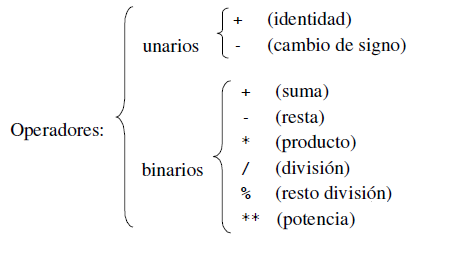
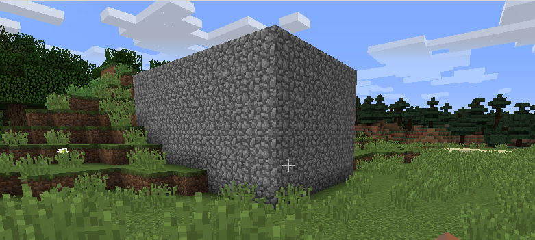

# 2. Operaciones  aritméticas y lógicas
## 2.1. Operaciones aritméticas

Python proporciona un conjunto completo de operadores aritméticos.

En la siguiente imagen se ve un esquema de todos los operadores: 




El operador de división  produce un valor de coma flotante, no un entero; muchos otros lenguajes de programación producirían un entero, truncando la parte decimal.

```python
>>> 12/3
4.0
>>> 3/2
1.5
```

Veamos unos ejemplos de utilización de los operadores:

```python
>>> a=5
>>> a
5
>>> a += 8
>>> a
13
```

Operador suma con cadenas (concatenación):

```python
>>> nombre = "Victor"
>>> nombre + "Perez"
'VictorPerez'
```

Operador suma con listas (añadir elemento):

```python
>>> deportes = ["ciclismo", "natación", "atletismo"]
>>> deportes += ["tenis"]
>>> deportes
['ciclismo', 'natación', 'atletismo', 'tenis']
```

## 2.2. Operaciones lógicas
Python proporciona cuatro conjuntos de operaciones lógicas. 

### 2.2.1. El operador identidad

```python
>>> a=["uno",2, None]
>>> b=["uno",2, None]
>>> a is b
False
>>> b=a
>>> a is b
True
```

El caso más común de is es comparar u item de datos con el objeto null, None, que se usa a menudo como valor "desconocido" o "no existente"

```python
>>> a="Algo"
>>> b=None
>>> a is not None, b is None
(True, True)
>>> 
```

El propósito del operador identidad es ver si dos referencias a objeto apuntan al mismo objeto o para ver si un objeto es None.

### 2.2.2. Operadores de comparación 

  	== 	 es igual que
  	!= 	 es distinto de
  	< 	 es menor que
  	<= 	 es menor o igual que
  	> 	 es mayor que
  	>= 	 es mayor o igual que

Una particularidad de los operadores de comparación en Python es que pueden ser encadenados:

```python
>>> a=9
>>> 0 <= a <= 10
True
```

### 2.2.3. El operador de pertenencia

Para tipos de datos que son secuencias o colecciones como strings, listas y tuplas, podemos comprobar la pertenencia usando el operador in, y para la no pertenencia el operador not in. Por ejemplo:

```python
>>> p =(4, "hola", 9, -33, 9, 2)
>>> 2 in p
True
>>> "adios" not in p
True
```

### 2.2.4. Operadores lógicos

Python provee tres operadores lógicos:

    and --> conjunción |

    or --> disyunción  |--> Asociativos por la izquierda

    not --> negación   |--> unario

### 2.2.5. Práctica en Minecraft

#### 2.2.5.1. ¿Estoy en el agua?

Copia el siguiente código en un archivo nuevo desde IDLE y guárdalo con el nombre *compruebaBloque.py*
Prueba a ejecutarlo y trata de entenderlo.

```python
from mcpi import minecraft
mc = minecraft.Minecraft.create()

pos = mc.player.getPos()
x = pos.x
y = pos.y
z = pos.z

tipoDeBloque = mc.getBlock(x, y, z)
mc.postToChat(tipoDeBloque == 9)    # Si el jugador está en el agua, 
									# pondrá True, en caso contrario, pondrá False.

```

#### 2.2.5.2. ¿Estoy encima del suelo?

Copia el siguiente código en un archivo nuevo desde IDLE y guárdalo con el nombre *encimaDelSuelo.py*
Prueba a ejecutarlo y trata de entenderlo.

```python
from mcpi import minecraft
mc = minecraft.Minecraft.create()

pos = mc.player.getTilePos()

x = pos.x
y = pos.y
z = pos.z

bloqueMasAltoY = mc.getHeight(x, z)
encimaDelSuelo = y >= bloqueMasAltoY

mc.postToChat("El jugador está encima del suelo: " + str(ensimaDelSuelo))
```
Este programa obtiene la posición actual del jugador, después la coordenada y del bloque más alto en la posición del jugador y después asigna a la variable encimaDelSuelo el valor lógico de evaluar *y >= bloqueMasAltoY*.

#### 2.2.5.3. ¿Estoy totalmente bajo el agua?

Copia el siguiente código en un archivo nuevo desde IDLE y guárdalo con el nombre *bajoElAgua.py*
Prueba a ejecutarlo y trata de entenderlo.

```python
from mcpi import minecraft
mc = minecraft.Minecraft.create()

pos = mc.player.getPos()
x = pos.x
y = pos.y
z = pos.z

tipoDebloque = mc.getBlock(x, y, z)
tipoDebloque2 = mc.getBlock(x, y + 1, z)

bajoElAgua = tipoDebloque == 9 and tipoDebloque2 == 9
mc.postToChat("El jugador está bajo el agua: " + str(bajoElAgua))
```

#### 2.2.5.4. ¿Estoy dentro de casa?

Copia el siguiente código en un archivo nuevo desde IDLE y guárdalo con el nombre *construyeCasa.py*
Prueba a ejecutarlo y trata de entenderlo.
```python
from mcpi import minecraft
mc = minecraft.Minecraft.create()

pos = mc.player.getTilePos()
x = pos.x
y = pos.y
z = pos.z
anchura = 10
altura = 5
longitud = 6
tipoDeBloque = 4
aire = 0
mc.setBlocks(x, y, z, x + anchura, y + altura, z + longitud, tipoDeBloque)
mc.setBlocks(x + 1, y + 1, z + 1,
             x + anchura - 1, y + altura - 1, z + longitud - 1, aire)
```             

Este es el bloque (casa) construido con el código anterior:



Ahora copia el siguiente código en un archivo nuevo desde IDLE y guárdalo con el nombre *dentroDeCasa.py*
Prueba a ejecutarlo y trata de entenderlo.

```python
from mcpi import minecraft
mc = minecraft.Minecraft.create()

casaX = 10
casaY = 11
casaZ = 12
anchura = 10
altura = 5
longitud = 6

pos = mc.player.getTilePos()
x = pos.x
y = pos.y
z = pos.z

dentroDeCasa = casaX < x < casaX + anchura and casaY < y < casaY + altura and casaZ < z < casaZ + longitud
mc.postToChat("El jugador está en casa: " + str(dentroDeCasa))
```


[Vuelve al índice](https://jolosan.github.io/minecraft/aprende.html)
