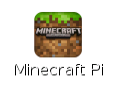
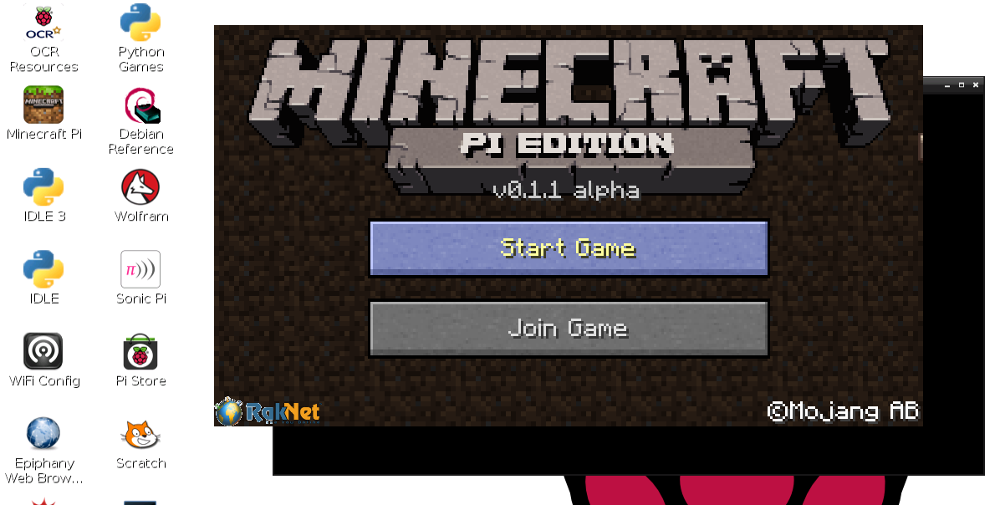

# Instalación del Software 

Minecraft está instalado por defecto en Raspbian desde septiembre de 2014.



Si estás usando una versión antigua de Raspbian, abre una ventana de terminal y escribe los siguientes comandos (debes de estar conectado a Internet):

```bash
sudo apt-get update
sudo apt-get install minecraft-pi
```

Una vez haya terminado lo anterior, Minecraft Pi y la librería de Python para Raspberry Pi deberían estar instalados.

## Prueba Minecraft

Para ejecutar Minecraft haz doble click sobre el icono del escritorio o escribe `minecraft-pi` en el terminal.



Cuando se haya cargado Minecraft Pi, haz click en **Start Game**, seguido de **Create new**. Notarás que la ventana que lo contiene se desplaza ligeramente. Esto significa que para arrastrar la ventana alrededor del escritorio, debemos coger la barra de título de detrás de la ventana de Minecraft.


¡Ahora estás en el juego de Minecraft!

## Prueba Python

Con Minecraft en ejecución, y el mundo creado, quitamos el foco del juego pulsando la tecla `Tab`, así habremos liberado el ratón. Abre IDLE3 en el escritorio y mueve las ventanas para poner una al lado de la otra.

Ahora puedes introducir las órdenes directamente en la ventana de Python o crear un fichero para guardar el programa y ejecutarlo en otra ocasión.

Si quieres crear un fichero, ve a `Archivo > Nueva ventana` y `Archivo > Guardar`. Probablemente querrás guardarlo en tu carpeta personal o en una carpeta de proyectos.

Empieza importando la librería de Minecraft, creando una conexión con el juego y probándolo escribiendo el típico mensaje "Hello world" en la pantalla:

```python
from mcpi import minecraft

mc = minecraft.Minecraft.create()

mc.postToChat("Hello world")
```

Si estás escribiendo órdenes directamente en la ventana de Python, únicamente pulsa `Intro` después de cada línea. Si es un fichero, guárdalo con `Ctrl + S` y ejecutalo con `F5`. Cuando se ejecuta el código, deberías ver tu mensaje en la pantalla del juego.


Si ves "Hello world" en la ventana de the Minecraft, puedes continuar con la [práctica inicial](worksheet.md).
