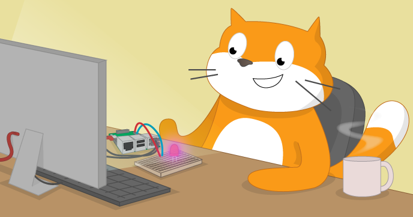

# Acceso al mundo físico con Scratch

The version of Scratch included with the Raspberry Pi has a number of unique features; one of the most useful is its ability to communicate with the General-Purpose Input/Output pins, or GPIO. These pins allow you to connect your Raspberry Pi to a range of devices, from lights and motors to buttons and sensors. The Raspberry Pi 2 has 40 GPIO pins, whilst the original Raspberry Pi only has 26, but this workshop will work with either model.

La versión de Scratch incluida con la Raspberry Pi tiene una serie de características únicas; una de los más útiles es su capacidad para comunicarse con los pines de entrada/salida de uso general, o GPIO (General Purpose Input Output). Estos pines le permiten conectar la Raspberry Pi a una gama de dispositivos, desde luces y motores a botones y sensores. La Raspberry Pi 2 y la 3 tienen 40 pines GPIO, mientras que el Raspberry Pi original  sólo tiene 26, pero este taller funcionará con cualquiera de ambos modelos.

## Licencia

A menos que se especifique otra cosa, todo lo que hay en éste repositorio está cubierto por la siguiente liciencia: 

***Acceso sal mundo físico con Scrath*** by the [Raspberry Pi Foundation](http://www.raspberrypi.org) is licenced under a [Creative Commons Attribution 4.0 International License](http://creativecommons.org/licenses/by-sa/4.0/).

Basado en el trabajo de https://github.com/raspberrypilearning/physical-computing-with-scratch
