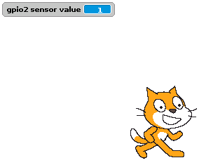

## Configuring your button

- Before Scratch can react to your button, it needs to be told which pin is configured as an input pin.

- Assuming you have started a new Scratch file, you'll also need to start the GPIO server. The following code will configure pin 4 as an input:

  

- Once you have built the code above, you need to click the green flag in order for it to run and for your pin to be set up.

- Next, you need to go to the Sensing menu in Scratch:

  

- From here you need to find the  block and click the triangle to reveal a menu. Select **gpio2** from the menu and click the tickbox to the left:

  

- You should now see the current state of the pin in the stage area:

  

- Now when you press your button, the state should change from 1 to 0.

