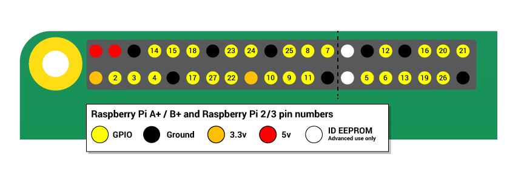

## pines GPIO

Una característica poderosa de la raspberry Pi es la fila de pines GPIO a lo largo del borde superior de la placa. GPIO significa entrada/salida de uso general. Estos pines son una interfaz física entre la raspberry Pi y el mundo exterior. En el nivel más simple, se puede pensar en ellos como interruptores que se puede activar o desactivar (entrada) o que el Pi puede activar o desactivar (salida).

Los pines GPIO permiten a la raspberry Pi controlar y monitorizar el mundo exterior por estar conectados a circuitos electrónicos. El Pi es capaz de controlar los LED, encenderlos o apagarlos, mover motores, y muchas otras cosas. También es capaz de detectar si se ha pulsado un interruptor, la temperatura y la luz. Nos referimos a esto como computación física.

Hay 40 pines en la Raspberry Pi (26 pines en modelos antiguos), y proporcionan varias funciones diversas.

Si tienes una etiqueta de pines RasPiO, puede ayudarte a identificar para qué se usa cada pin. Asegurate de que la etiqueta de pines esté colocada con el agujero hacia los puertos USB, apuntando hacia afuera.

Si no tienes una etiqueta de pines, esta guía puede ayudarte a identificar los números de pin:

Verás pines etiquetados como 3V3, 5V, GND y GP2, GP3, etc:

|   |   |   |
|---|---|---|
| 3V3 | 3.3 volts | Cualquier cosa conectada a estos pines siempre obtendrá 3.3V de potencia |
| 5V | 5 volts | Cualquier cosa conectada a estos pines siempre obtendrá 5V de potencia |
| GND | ground | Cero voltios, usado para completar un circuito |
| GP2 | GPIO pin 2 | Estos pines son para uso general y se pueden configurar como pines de entrada o de salida |
| ID_SC/ID_SD/DNC | Pines de propósito general ||

**ADVERTENCIA**: Si sigues las instrucciones, jugar con los pines GPIO es seguro y divertido. Sin embargo, al conectar aleatoriamente cables y fuentes de alimentación en la Raspberry Pi, puede destruirla, especialmente si utilizamos los pines de 5V. Cosas malas también pueden suceder si tratas de conectar cosas a tu Pi que usan mucha energía; Los LED están bien, los motores no lo son. Si estás preocupado por esto, es posible que desees considerar el uso de una tarjeta complementaria como la [Explorer HAT](https://shop.pimoroni.com/products/explorer-hat) hasta que tengas suficiente soltura para usar los GPIO directamente.

