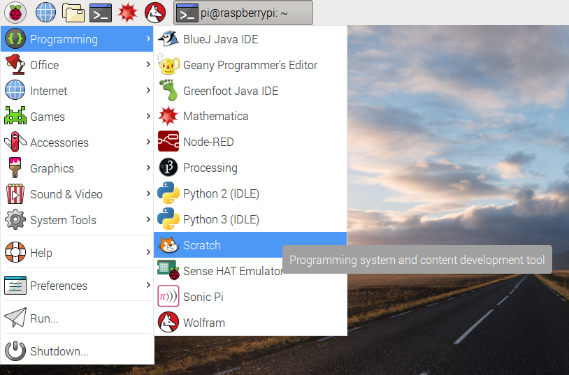
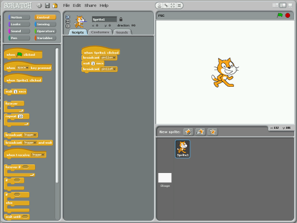

## Constructing a Scratch program

-  Locate the Scratch program by clicking on **Menu** followed by **Programming**, and selecting **Scratch**.

 

- The familiar Scratch interface will then load:

 

-  Click on **Control** in the top-left display. Drag the `when GreenFlag clicked` block onto the scripts area:

  

- Scratch uses **broadcast** blocks to communicate with the GPIO pins; the first broadcast you need is `gpioserveron` which activates the GPIO functionality:

  

- As your GPIO pin can be used as either input or output, you'll need to specify in which mode your pin is being used with the `config17out` broadcast:

  

- From this point on, you can control your LED using two broadcasts: `gpio17high` to turn it on and `gpio17low` to turn it off. Using these two messages and some pauses, you can make an LED flash continuously:

  

