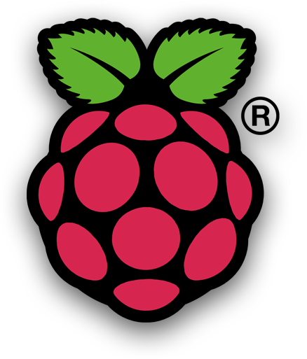

# Prácticas con la Raspberry Pi

## Licencia

A menos que se especifique otra cosa, todo lo que hay en éste repositorio está cubierto por la siguiente liciencia: 

***Minecraft Pi*** by the [Raspberry Pi Foundation](http://www.raspberrypi.org) está licenciado bajo [Creative Commons Attribution 4.0 International Licence](http://creativecommons.org/licenses/by-sa/4.0/).

Basado en el trabajo de https://github.com/raspberrypilearning/getting-started-with-minecraft-pi